# AthlasX — Complete Platform Reference

Generated 2026-09-11 by direct code reading (every page and API route file read in full, not summarized from names) plus a live browser walkthrough of the running dev server. Every claim below is traceable to a file:line or a live screenshot — nothing here is inferred from naming conventions alone. Where something could not be verified live, that is stated explicitly rather than assumed.

**Stack:** Next.js 14.2.35 (App Router) · TypeScript · Tailwind (custom `ax-*` design tokens) · Prisma 6 / Postgres (Supabase) · NextAuth (JWT sessions, credentials-only) · Framer Motion · Sentry (`@sentry/nextjs`, wired but no DSN configured yet).

---

## Table of Contents

1. [Screenshot Gallery](#1-screenshot-gallery)
2. [Frontend — Public & Onboarding Pages](#2-frontend--public--onboarding-pages)
3. [Frontend — Dashboard & Role Pages](#3-frontend--dashboard--role-pages)
4. [Backend — API Route Catalog](#4-backend--api-route-catalog)
5. [Security Mechanisms](#5-security-mechanisms)
6. [Database — Schema & Maintenance](#6-database--schema--maintenance)
7. [Git History — Feature-Area Commit Log](#7-git-history--feature-area-commit-log)
8. [Known Gaps & Miscellaneous Notes](#8-known-gaps--miscellaneous-notes)

---

## 1. Screenshot Gallery

All screenshots below were captured live against the running dev server (`npm run dev`), via a real headless Chrome instance (Chrome DevTools Protocol), not mocked. Files live in `docs/screenshots/`. Public pages required no login. Authenticated pages were captured signed in as `staff@upca.example` (an `association`-role account seeded by `prisma/seed.ts`, real data attached — UPCA association, one trial cycle, ingest jobs, a grading session). Two pages (`/grading`, `/convergence`) are shown mid-loading-spinner — their client-side fetch chain hadn't resolved by the time the shot was taken; the fully-loaded state of both is documented in full in §3 from source code.

| Page | Screenshot | Auth used |
|---|---|---|
| Landing (`/`) | [landing.png](screenshots/landing.png) | none |
| Sign in / Sign up (`/auth`) | [auth-signin.png](screenshots/auth-signin.png) | none |
| Player onboarding, Stage 1 (`/player/onboarding`) | [player-onboarding-stage1.png](screenshots/player-onboarding-stage1.png) | none |
| Coach onboarding, Step 1 (`/coach/onboarding`) | [coach-onboarding-step1.png](screenshots/coach-onboarding-step1.png) | none |
| Academy onboarding — not-available state (`/academy/onboarding`) | [academy-onboarding-not-available.png](screenshots/academy-onboarding-not-available.png) | none (`ACADEMY_SELF_SERVE_ENABLED=false`) |
| Scout onboarding, Step 1 (`/scout/onboarding`) | [scout-onboarding-step1.png](screenshots/scout-onboarding-step1.png) | none |
| Association self-serve onboarding, Step 1 (`/onboarding/association`) | [association-onboarding-step1.png](screenshots/association-onboarding-step1.png) | none |
| 404 (`/anything-nonexistent`) | [not-found.png](screenshots/not-found.png) | none |
| Ops/cross-role Dashboard (`/dashboard`) | [dashboard-ops-view.png](screenshots/dashboard-ops-view.png) | association |
| Association Overview (`/association`) | [association-dashboard.png](screenshots/association-dashboard.png) | association |
| Trial Cycles (`/trial-cycles`) | [trial-cycles.png](screenshots/trial-cycles.png) | association |
| Ingest & Data (`/ingest`) | [ingest.png](screenshots/ingest.png) | association |
| Weekly Tracking (`/tracking`) | [tracking.png](screenshots/tracking.png) | association |
| Identity Exceptions (`/identity-exceptions`) | [identity-exceptions.png](screenshots/identity-exceptions.png) | association |
| Academy Matching (`/academy-matching`) | [academy-matching.png](screenshots/academy-matching.png) | association |
| Coach Signups (`/coach-signups`) | [coach-signups.png](screenshots/coach-signups.png) | association |
| Notifications (`/notifications`) | [notifications.png](screenshots/notifications.png) | association |
| Settings (`/settings`) | [settings.png](screenshots/settings.png) | association |
| Selection / Candidate Pool (`/selection`) | [selection.png](screenshots/selection.png) | association |
| Grading (`/grading`, loading state) | [grading-loading-state.png](screenshots/grading-loading-state.png) | association |
| Convergence (`/convergence`, loading state) | [convergence-loading-state.png](screenshots/convergence-loading-state.png) | association |

**Not live-captured, and why:**
- **`error.tsx`, `global-error.tsx`** — already live-verified earlier this session (deliberately-thrown error caught correctly, retry button worked, Sentry capture fired with no error) but not re-captured as a saved file for this document; fully described in §2.
- **`/record`, `/coach`, `/scout`, `/academy/**`** (player/coach/scout/academy_admin home dashboards) — no existing credentials were available for these roles that I could use without resetting a password (blocked — see §8), and creating brand-new accounts through the live multi-step OTP signup wizards wasn't completed in this pass. Fully documented from source in §3, including every button and every field.
- **`/ops/associations/new`, `/ops/associations/pending`, `/ops/scouts/pending`** — require an `athlasx_ops` account; no self-serve path exists to create one and none of the existing `athlasx_ops` accounts' passwords were available. Fully documented from source in §3.
- **`/trial-cycles/[id]/register`, `/trial-cycles/[id]/dossiers`** — require a real trial-cycle ID in the URL; documented from source in §3.

---

## 2. Frontend — Public & Onboarding Pages

Every page below was read in full (not the first N lines) — button handlers, validation rules, and OTP flows are traced to the actual function bodies, not inferred from labels.

### `/` — `src/app/page.tsx`
**Audience:** Anonymous visitor. **Purpose:** Server component — if a session exists, redirects to that role's home page via `rootDestination()`; otherwise renders the marketing hero.
**Interactive elements:**

| Label | Triggers | Result |
|---|---|---|
| "Sign In" (top-right) | `<a href="/auth">` | Navigates to `/auth` |
| "Signup" (top-right) | `<a href="/auth">` | Navigates to `/auth` (same URL — doesn't pre-select the Sign Up tab) |

No forms, no OTP, no fetches. `HeroLanding.tsx` renders a 7-photo CSS-grid collage with a radial vignette and the "ATHLASX" wordmark; colors/fonts are scoped locally via inline CSS variables, not global Tailwind.

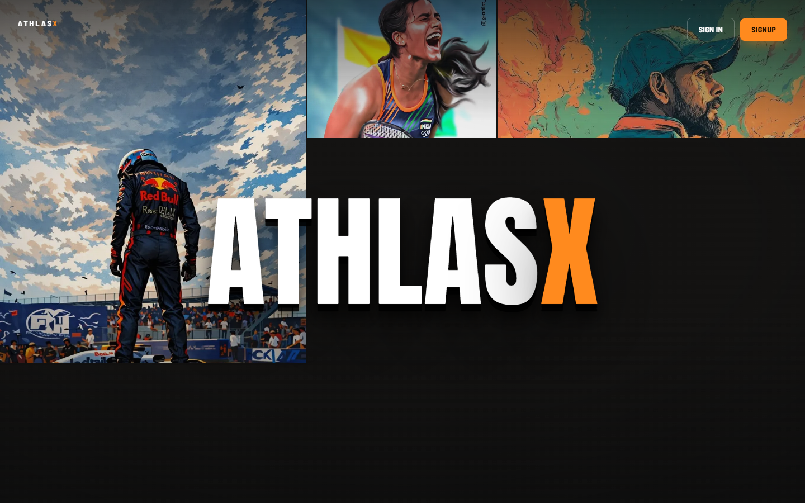

---

### `/auth` — `src/app/auth/page.tsx`
**Audience:** Anonymous visitor signing in or signing up (player, coach, academy, scout, association). **Purpose:** Single front door — Sign In posts credentials directly via NextAuth; Sign Up for player/coach creates a bare account then routes into that role's wizard, while association/academy/scout are routed straight to their own wizard from the role picker (no bare-account step for those three).

**Interactive elements:**

| Label | Triggers | Result |
|---|---|---|
| "Sign In" / "Sign Up" tabs | local `setMode()` | Switches the visible form |
| Sign In submit | `handleSignIn` → `signIn('credentials', {email,password,redirect:false})` | Error → "Incorrect email or password." inline. Success → `router.push('/')`, which redirects to the role home. |
| "Remember me" | — | Purely visual, not wired to anything |
| "Forgot password?" | `toast.info('Password reset isn't wired up yet.')` | Toast only — **no real password-reset flow exists anywhere in this codebase** |
| Role `<select>` | `handleRoleSelect` | `association`/`academy`/`scout` → immediately navigates away to that role's wizard. `player`/`coach` → reveals the inline sign-up form. |
| Sign-Up submit (player/coach) | `handleRoleSignUp` → `POST /api/auth/signup {role,email,password}` | Error → inline message. Success → `router.push()` to that role's onboarding wizard. |
| "Continue with Google" | `toast.info('Google sign-in isn't connected yet.')` | Toast only — no OAuth provider configured |
| "Terms" / "Privacy Policy" | `href="#"` | Dead links |

**Fields:** Email + Password (both tabs, `required`); Sign-Up password additionally has `minLength={10}`. No OTP on this page.

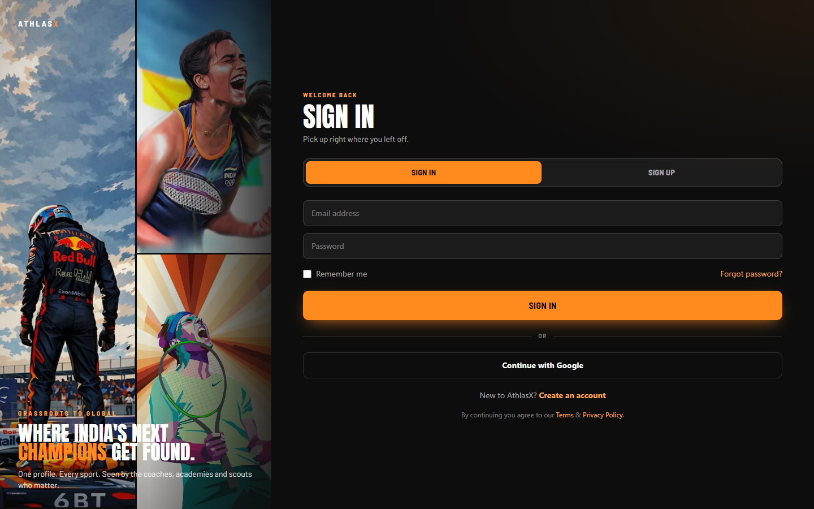

---

### `/player/onboarding` — `src/app/player/onboarding/page.tsx`
**Purpose:** 3-stage wizard that is itself the account-creation surface for players (collects email+password in Stage 1, not a post-signup profile step).

**Stage 1 — Basic Info:** Full name, Email, Password (`minLength=10` + helper text), DOB, Gender, City, District, State, conditionally Guardian name/phone (if the DOB computes as a minor), Enrollment date, Highest level represented, CricHeroes handle, Playing role / Batting style / Bowling style (button groups), Preferred formats (multi-select), Academy (free text — `onBlur` triggers `GET /api/academy/lookup` to populate a Batch dropdown).

**Stage 2 — Aadhaar Verification:** Player's own 12-digit Aadhaar → "Send OTP" → `POST /api/onboarding/aadhaar/initiate` → dev-mode banner shows the real code (no eKYC vendor exists — this is a documented dev stub, see §5) → 6-digit entry → "Verify" → `POST /api/onboarding/aadhaar/verify`. If the player is a minor, a **second, independent** `AadhaarBlock` for the guardian runs the identical flow.

**Stage 3 — Footage, Bio & Consent:** Batting/Bowling/Keeping clip URLs (optional), YouTube channel (optional), Bio (400-char max with live counter), a read-only review table, then four scroll-gated consent panels (checkbox stays disabled until the panel is scrolled to its end): Data collection & use; DPDP guardian consent (minors only); Visibility & sharing; Terms.

**Submit** → `POST /api/player/onboard` with the full payload including both Aadhaar `requestId`s (the server re-verifies server-side via `consumeVerifiedAadhaar` — it never trusts the client's "verified" flag). On an Aadhaar-verification failure at this point, the wizard resets just that OTP state and drops back to Stage 2 with a toast, preserving every other field — nothing is lost.

The whole form auto-persists to `localStorage` after every stage advance (single-device only) — returning mid-wizard shows a "Welcome back — picked up where you left off" toast.

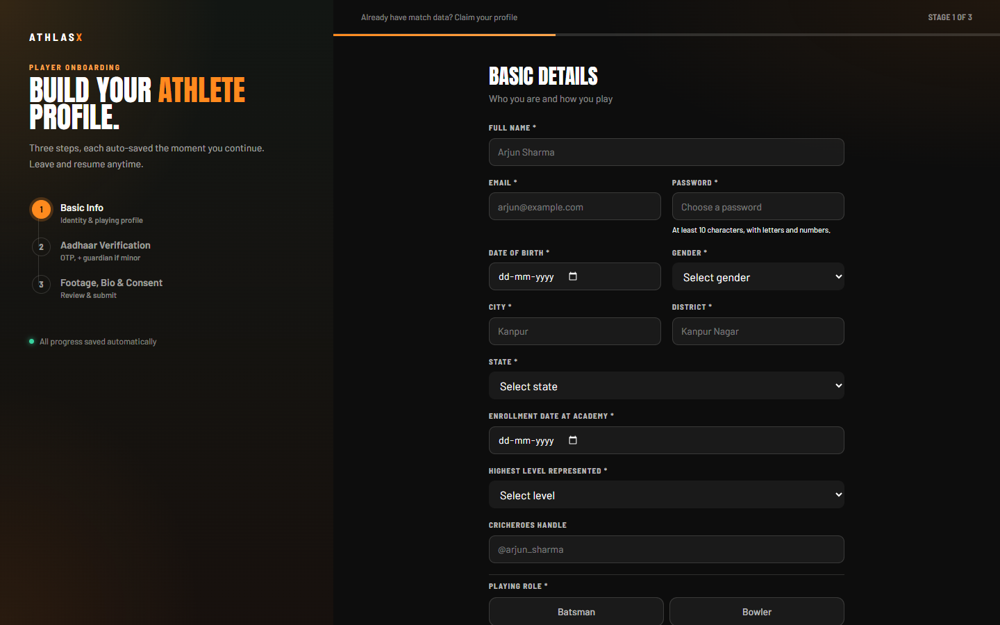

---

### `/coach/onboarding` — `src/app/coach/onboarding/page.tsx`
**Purpose:** 4-step wizard. Only Step 1 (account) and Step 4 (association) are persisted — Steps 2–3 are collected for design fidelity but have no backing schema columns (documented explicitly in the file's own header comment).

**Step 1 — Account:** Full Name, Mobile (+91, Send/Resend OTP → `POST /api/coach/onboard/send-otp`), OTP entry, Email, Password. **Verify is client-side only** — it compares the typed digits against the `devCode` already sitting in state, no network call; the real check happens server-side at final submit.
**Step 2 — Experience** *(not persisted)*: Coaching role, specialisation chips, years-of-experience stepper, played-at-state-level toggle.
**Step 3 — Certifications** *(not persisted)*: BCCI level badges, fake certificate upload.
**Step 4 — Association:** Search + card-select from a fetched association list — **required**, since `CoachProfile.association_id` is a real column.

Submit → `POST /api/coach/onboard`. Success screen: "You're a coach on AthlasX" + "Certifications are under review (24–48h) — you can start coaching now with a pending badge," then "Go to Dashboard."

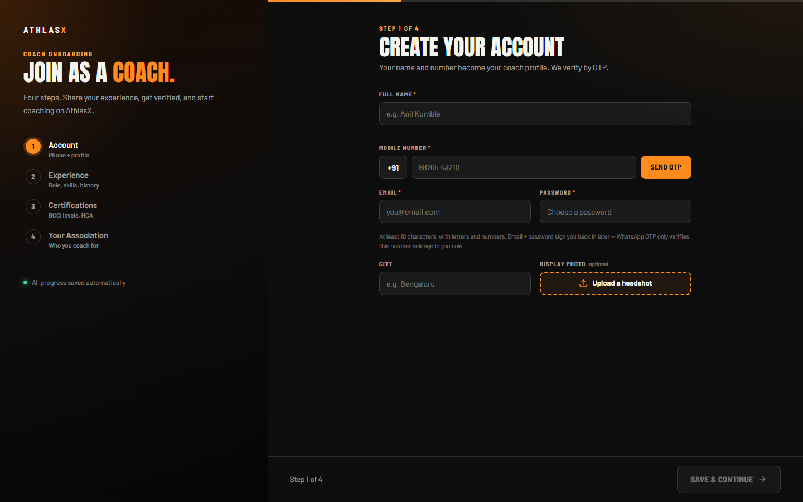

---

### `/academy/onboarding` — `src/app/academy/onboarding/page.tsx`
**Gated:** `ACADEMY_SELF_SERVE_ENABLED` — **default false** (confirmed 2026-09-11 launch decision: "we do not sell to individual academies in phase 1"). With the flag off, the page short-circuits (after all hooks, to preserve hook order) to a static notice.

**When enabled**, it's a 3-step wizard (compressed this session from an original 5 — the deleted Facilities/Staff and Programs steps had no backing schema columns, confirmed by reading the POST route directly): Step 1 Account (phone OTP + email/password), Step 2 Academy Identity + a "Coaching & Affiliation" sub-section (head coach, BCCI/state-association affiliation — these five fields *are* persisted), Step 3 Go Live (fake invite/batch-creation UI, explicitly illustrative).

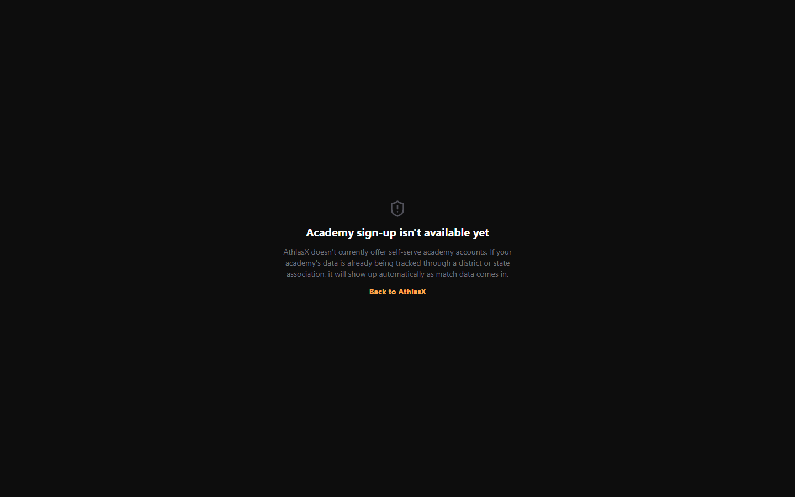

---

### `/scout/onboarding` — `src/app/scout/onboarding/page.tsx`
**Gated:** `SCOUT_SELF_SERVE_ENABLED` — default **true**. 2-step wizard, every field persisted: Step 1 Account (phone OTP, email, password), Step 2 Organization (name, type — Franchise/Academy-recruiting-arm/Independent, optional contact). Same client-side-only OTP "verify" pattern as coach/academy. Explicit in-wizard disclosure: "You'll only ever see adult players who opted in to scout visibility — enforced platform-wide, cannot be changed from your account."

Account is created with `ScoutProfile.verification_status: 'pending'` — real dashboard access is withheld until an Ops reviewer approves it (see `/scout/pending` and `/ops/scouts/pending` in §3).

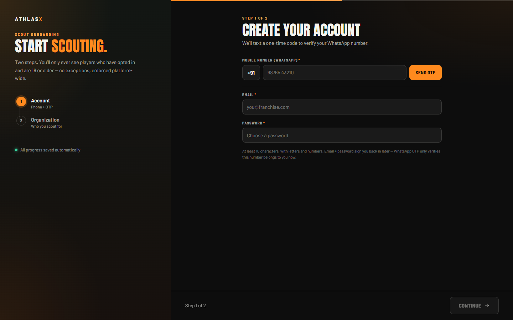

---

### `/onboarding/association` — `src/app/onboarding/association/page.tsx`
**Gated:** `ASSOCIATION_SELF_SERVE_ENABLED` — default **true**. 3-step wizard, **no phone/OTP anywhere** (email+password only — associations have never used phone verification, per the file's own comment): Step 1 Account, Step 2 Identity (name, State/District type, optional parent-association picker for districts), Step 3 a scroll-gated data-sharing consent agreement + checkbox.

Submits to `POST /api/associations/self-serve-onboard`, which creates the `Association` row with `verification_status: 'pending'` explicitly — the account is signed in immediately but lands on a holding state, not the real dashboard, until AthlasX Ops approves it.

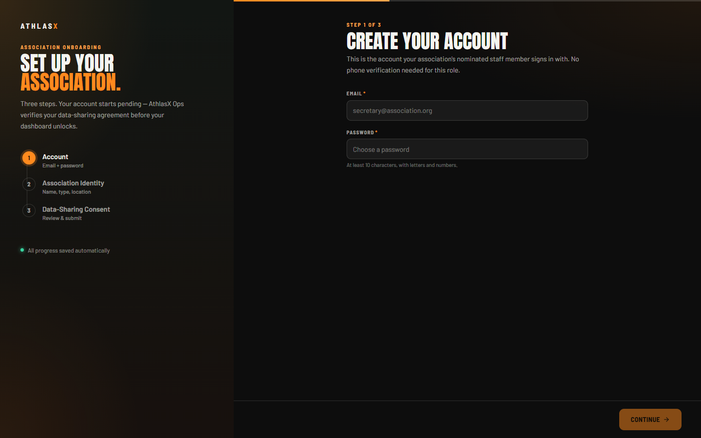

---

### `/claim` — `src/app/claim/page.tsx`
**Purpose:** Lets a player (already ingested as a "shadow profile" from association match data, never having logged in) take ownership of their existing record via phone OTP, rather than creating a duplicate through `/player/onboarding`. 5 steps: search (name+district+DOB) → select candidate → details (phone, or guardian phone+name+relation if a minor) → OTP → done. Unlike every onboarding wizard's OTP, this one is **DB-backed** (`PhoneOtp` table, bcrypt-hashed, real expiry/attempt columns) and the dev code is **never sent to the client** — only logged server-side outside production, since this flow can take over someone else's existing profile.

---

### `/join/[academyId]` — `src/app/join/[academyId]/page.tsx`
**Purpose:** Fully public, no AthlasX account anywhere in the flow — a parent opens an academy's invite link and submits a *pending* join request for that academy's admin to approve. Deliberately uses a different, light Inter-font visual theme ("meant to be opened by a parent on their own phone," per the file's comment) rather than the shared dark onboarding system. Gender/Role/Batting-style/State fields are collected in the UI but **not actually sent to the server** — collected for mockup fidelity only.

---

### `/error` (route-segment boundary) — `src/app/error.tsx`
Client component. Catches any unhandled exception below the root layout — the safety net underneath each page's own manual error handling, not a replacement for it. "Try again" calls Next's `reset()`; "Back to AthlasX" links to `/`. Reports to Sentry via `Sentry.captureException(error)` in a mount effect. Shows the raw error message only outside production. **Live-verified earlier this session**: a deliberately-thrown test error was caught correctly, the retry button worked, and Sentry's capture call fired without itself throwing (no DSN configured yet, so it no-ops safely rather than reporting anywhere).

### (root-layout crash) — `src/app/global-error.tsx`
Narrower sibling of `error.tsx` for a crash in the root layout itself — must supply its own `<html>/<body>` since the layout that would normally provide them is what crashed. Deliberately uses inline styles, zero Tailwind, in case the CSS pipeline itself never initialized.

### (unmatched route) — `src/app/not-found.tsx`
Server component. Styled 404 with a "Back to AthlasX" link, same `ax-*` visual system as the rest of the app. Live-verified this session (correct 404 status, correct rendering).

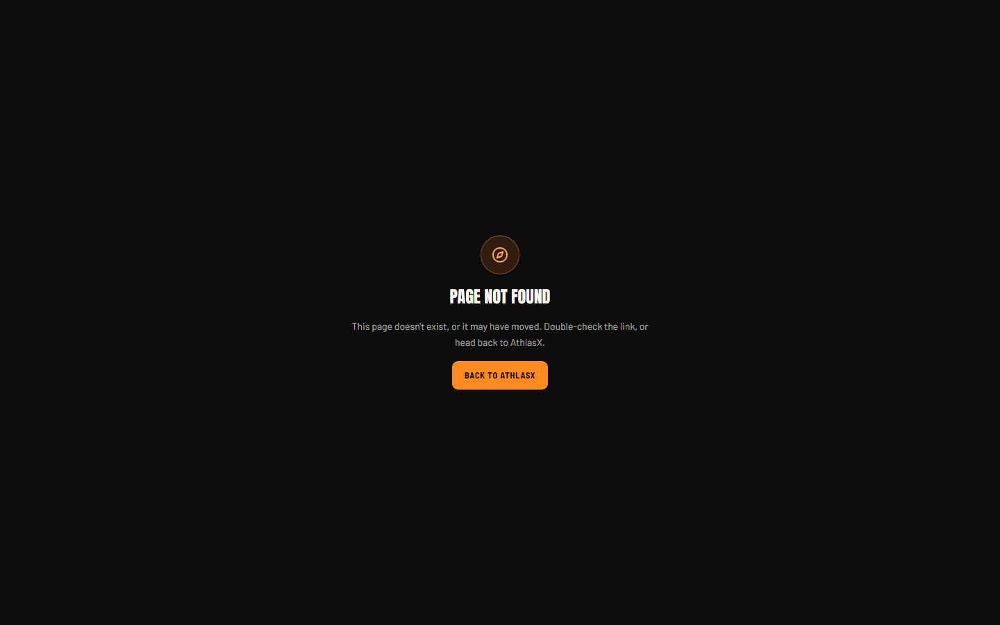

---

## Cross-cutting notes on the onboarding layer

- **Two visual systems.** Pages built in the 2026-09 design pass (landing, auth, all 5 onboarding wizards, error/not-found) share one orange/Anton-Barlow dark system, each scoping its own CSS variables locally rather than through global Tailwind config. `/claim` predates that pass (green-gradient glass-card theme). `/join/[academyId]` deliberately breaks from both (light Inter theme, parent-on-phone context).
- **Re-entry lock pattern.** Every wizard except `/onboarding/association` and `/claim` uses an identical `useRef<Set<string>>` synchronous lock around every async action, to stop a double-click from firing the same request twice before React state catches up.
- **Client-side-only "Verify" for coach/academy/scout OTP.** Unlike the player wizard's Aadhaar flow (which calls a real `/verify` endpoint) and the claim flow (DB-backed, never echoes the code to the client), coach/academy/scout onboarding's "Verify" button just compares the typed digits to a `devCode` already sitting in client state — the real check happens only at final wizard submission, server-side. All of these are dev stubs; no SMS/WhatsApp gateway is wired anywhere in this codebase.
- **Minor/guardian-age detection is implemented three separate times** (`isUnder18` in player onboarding, `minorFromDob` in claim, an inline calendar calculation in the join-link page) — no shared utility.
- **Post-submit navigation converges on `/`** for nearly every wizard, relying on the root page's session-based redirect to send the now-authenticated user to their actual role home.

---

## 3. Frontend — Dashboard & Role Pages

**Access-control architecture (applies to every page below):** `src/lib/require-page-session.ts` is the page-shell gate. `requirePageSession()` calls `notFound()` if there's no session; `requirePageRole(roles)` calls `notFound()` unless the session's role is in the allowlist — both render the same 404 an unauthenticated visit to a nonexistent route would, not a distinct "forbidden" screen. `src/lib/chrome.ts`'s `NAV_SECTIONS` maps each sidebar section to the roles that see it; `ROLE_HOME` maps each role to its landing route.

### `/dashboard` — `src/app/(dashboard)/dashboard/page.tsx`
**Role(s):** `association`, `selection_panel`, `coach`, `athlasx_ops` (`requirePageRole` in the route's layout). **Purpose:** cross-role pipeline overview — registrations, dossiers, ingest queue, form-drop alerts. Single `GET /api/dashboard` call on mount. "Manage cycles" and pipeline-step rows link to `/trial-cycles`; "View all" on Active Flags links to `/tracking`. Header text is hardcoded "Association Overview" regardless of which allowed role is actually viewing it.


---

### `/association` + `association/layout.tsx` — `src/app/(dashboard)/association/page.tsx`
**Role(s):** `association`, `athlasx_ops`; additionally, a not-yet-Ops-approved association is redirected to `/association/pending` before this page ever renders (`isAssociationAccessPending`). **Purpose:** an association's private command center — own trial cycles, scout convergence, tracked (flagged) players, coach-to-squad assignment. Four independent fetch groups (`/api/squads`, `/api/association/coaches`, `/api/trial-cycles/mine`, `/api/tracking`, `/api/grading/session`), each with its own loading/error/empty state. The **only** write action on the whole page is the inline coach-assignment `<select>` (`POST /api/squads/:id/coaches`) — everything else is read-only, matching the pivot document's role table per the file's own comment.

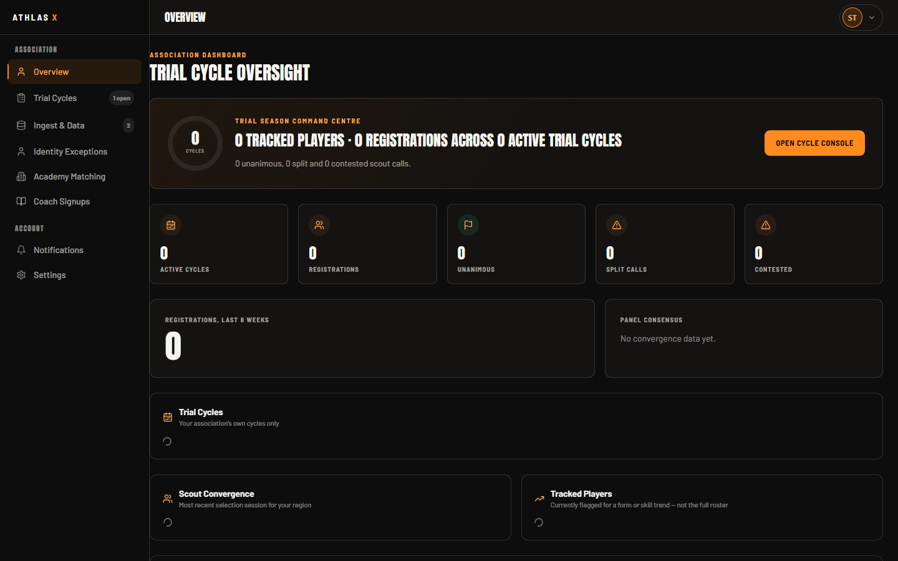

---

### `/coach` — `src/app/(dashboard)/coach/page.tsx`
**Role(s):** any authenticated session (`/api/coach/squad` scopes by the caller's own `SquadCoach` membership, not a role check). **Purpose:** a coach's roster — flagged players pinned to the top, an evaluation form (Fitness 1–5, Behaviour 1–5, notes ≤200 chars) submitting `POST /api/coach/:playerId/evaluate`. Explicit policy banner: ratings are "coach-supervised only... never from player self-report," and selectors only ever see the advisory note/flag, never raw ratings. *(Not live-screenshotted — no coach credential was available; see §1.)*

### `/scout` + `scout/layout.tsx` — `src/app/(dashboard)/scout/page.tsx`
**Role(s):** `scout`, `athlasx_ops`, gated additionally on `FRANCHISE_SCOUT_ENABLED` (default true); a not-yet-approved scout is redirected to `/scout/pending`. **Purpose:** read-only "Talent Pool" table (district/state/role filters, a "Score ≥ 65" toggle) — deliberately no contact/messaging affordance. A previously-shown "pending verification" banner was removed as dead code once the real server-side redirect gate made it unreachable. *(A live-authenticated view of this exact page was observed earlier this session via a pre-existing test session — confirmed real data rendering correctly — but not saved as a file for this document.)*

### `/record` — `src/app/(dashboard)/record/page.tsx`
**Role(s):** any authenticated session (self-scoped via `/api/my-record`). **Purpose:** a player's own AthlasX score breakdown, percentile vs. cohort, verified match history. Entirely read-only. Deliberately drops a mockup-only fabricated "average is up 6 runs" stat and a self-report "Log a match" CTA — self-reported match data is never part of the record. *(Not live-screenshotted — no player credential was available.)*

### `/academy` (and the 5 academy sub-pages) — gated by `ACADEMY_SELF_SERVE_ENABLED=false`
`/academy`, `/academy/batches`, `/academy/players`, `/academy/add-players`, `/academy/join-requests` all require role `academy_admin` **and** the feature flag — off by default, so this whole route group is currently unreachable in production even for an `academy_admin` account. Fully documented from source:
- **`/academy`** — dashboard: batch overview, enrollment trend, "Review N join requests" banner.
- **`/academy/batches`** — create batches (name, age group, weekly schedule), click a batch to see its roster panel. No edit/delete UI exists — the API only supports list+create.
- **`/academy/players`** — searchable read-only roster with a detail panel.
- **`/academy/add-players`** — three tabs: CSV bulk upload (with a downloadable template), manual single-entry form (guardian fields required if the computed age is under 18), and a WhatsApp/QR invite generator (the "QR code" is a text explanation, not a real rendered QR — no QR library is a dependency).
- **`/academy/join-requests`** — approve (pick a batch first) / reject queue for guardian self-registrations.

### `/academy-matching` — `src/app/(dashboard)/academy-matching/page.tsx`
**Role(s):** any authenticated session — the layout only calls `requirePageSession()`, no role restriction, and the backing API routes are `requireAuth`-only too (flagged as under-protected in §5). Two tabs: a fuzzy academy-name reconciliation queue (Confirm/Reject, never auto-merges even at high confidence) and a read-only "Production Ranking" leaderboard.

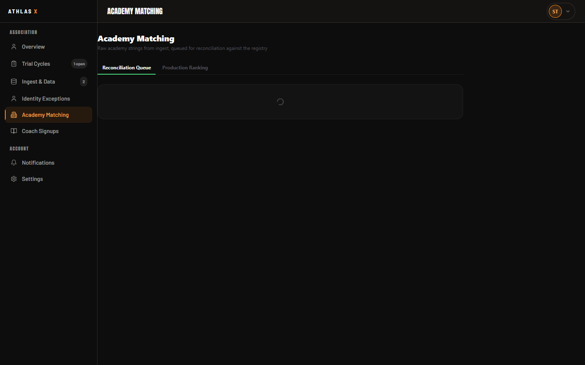

---

### `/coach-signups` — `src/app/(dashboard)/coach-signups/page.tsx`
**Role(s):** `association`, `athlasx_ops`. Explicitly a **read-only visibility list** (its own subtitle says so) of coaches who named this association during signup — not an approval queue; there is no action here at all.

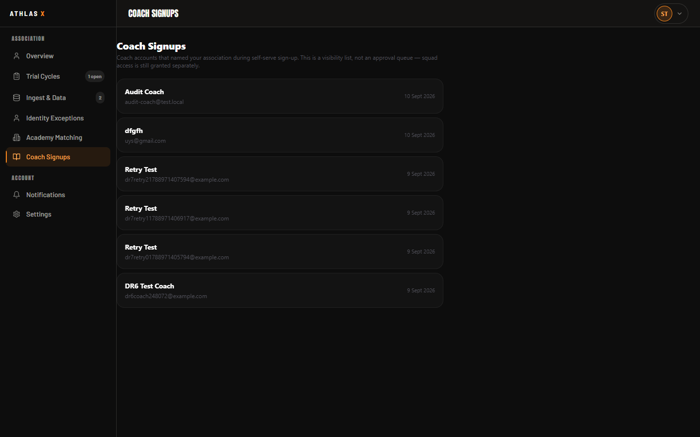

---

### `/selection` — `src/app/(dashboard)/selection/page.tsx`
**Role(s):** any authenticated session. Candidate-pool browser (search + role filter). **A known dead element**: candidate rows are styled `cursor-pointer` with a trailing chevron implying drill-down, but have no `onClick` handler wired at all.

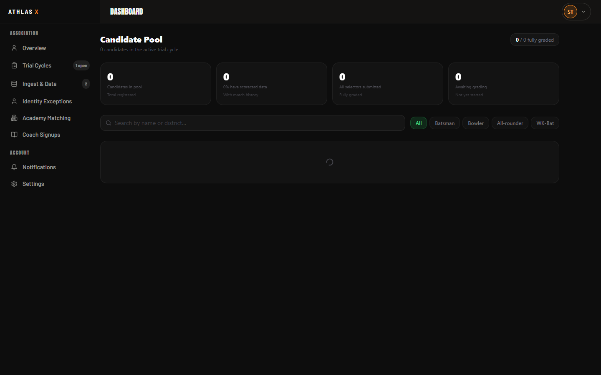

---

### `/grading` — `src/app/(dashboard)/grading/page.tsx`
**Role(s):** `selection_panel`, `association`, `athlasx_ops`. Blind independent grading: a Quick View (scorecard-derived stats only) plus a 1–10 grade + notes, submitted via `POST /api/grading/:sessionId/grade`. The blind boundary (a selector can't see anyone else's grade) is enforced purely by what the API sends back — there is no client-side masking to bypass. The session chair sees an "Unlock convergence" button the rest of the panel does not.

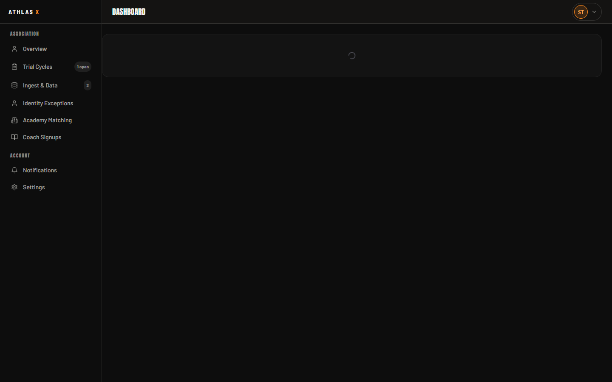

---

### `/convergence` — `src/app/(dashboard)/convergence/page.tsx`
**Role(s):** same allowlist as Grading. Post-unlock aggregated view (unanimous/split/contested per player), sortable, with checkbox selection feeding a final "Lock Squad" action (`POST /api/grading/:sessionId/lock-squad`) that creates immutable `Selection` rows.


---

### `/ingest` — `src/app/(dashboard)/ingest/page.tsx`
**Role(s):** `association`, `athlasx_ops`. Three source connectors feeding a review queue: a "Sync now" CricHeroes button (posts a documented **offline fixture**, explicitly not a live API call), a drag/drop CSV/JSON upload, and a downloadable CSV template. Each pending job opens a slide-over with Approve/Reject (`POST /api/ingest/:id/decide`) — approval is the real write path (creates Tournament/Match/Performance rows, resolves player identity, routes ambiguous rows to Identity Exceptions instead). Every upload control disables itself if the session has no resolvable `associationId`.

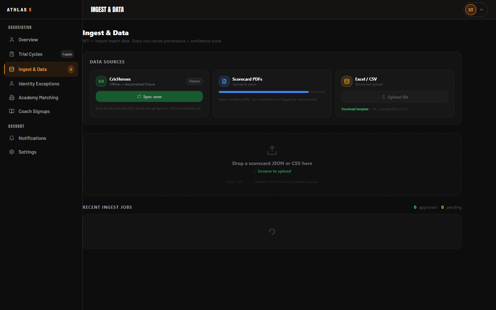

---

### `/tracking` — `src/app/(dashboard)/tracking/page.tsx`
**Role(s):** any authenticated session. Surfaces players with an active `TrendAlert` (form-drop/on-form/below-threshold filters), with a "Deep View" slide-over. The deep view explicitly excludes raw psych assessments and detailed coach evaluations — coach-only, not shown here even to selectors.

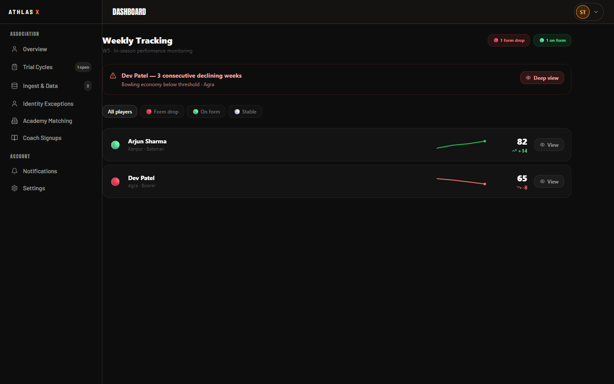

---

### `/identity-exceptions` — `src/app/(dashboard)/identity-exceptions/page.tsx`
**Role(s):** `association`, `athlasx_ops`. Human review queue for ingest rows the automatic identity resolver couldn't confidently attribute — Confirm / Merge (disabled with a tooltip if fewer than 2 candidates exist) / Split into a new profile.

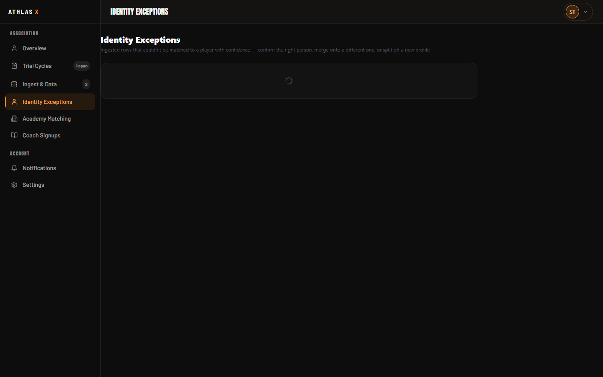

---

### `/trial-cycles` (+ `[id]/register`, `[id]/dossiers`) — `src/app/(dashboard)/trial-cycles/page.tsx`
**Role(s):** any authenticated session. A 3-step "New Trial Cycle" wizard (Age Category/DOB window/registration window/fee → repeatable venues → confirm+publish). **A known dead element**: each cycle card's "View registrations" button has no handler wired — the real per-cycle view exists at `/trial-cycles/[id]/dossiers` but nothing links to it from here. The register sub-page lets a player pick a venue, acknowledge a cash-only fee (no payment gateway integrated), and optionally attach proof documents/footage. The dossiers sub-page shows a master/detail list of registrants with a generated performance dossier per player (falls back to a "thin dossier" notice when no match history exists yet).

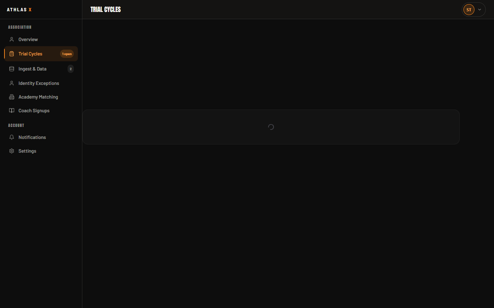

---

### `/profile`, `/notifications`, `/settings`
All three: any authenticated session. **`/profile`** — a minimal read-only identity card (email + role), reads only `useSession()`, no API call. **`/notifications`** — a player-focused feed of DOB-eligible trial cycles not yet registered for, plus status of existing registrations; explicitly documented as covering trial-cycle eligibility only (no selection-result or consent-request feed exists). **`/settings`** — the only page in the app using a toast (`sonner`) for feedback; lets a player choose `association_only` vs `cross_association` visibility (the `franchise_scout` tier is never offered here — hard-gated behind `FRANCHISE_SCOUT_ENABLED`, self-selection into it is not possible).

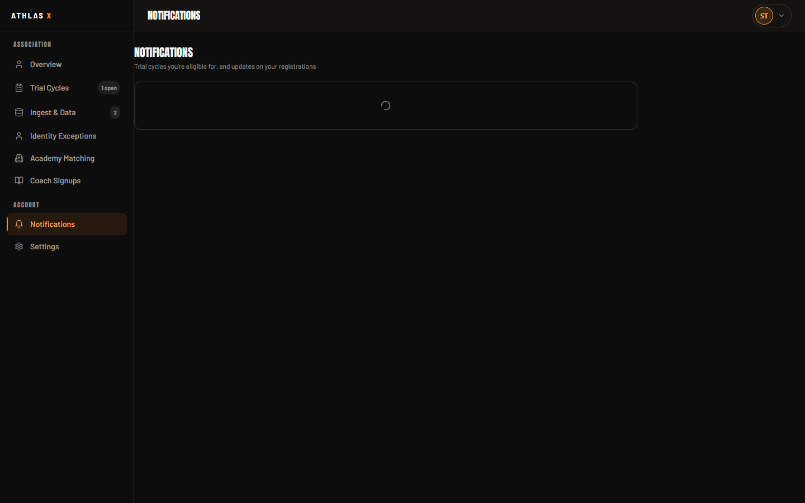
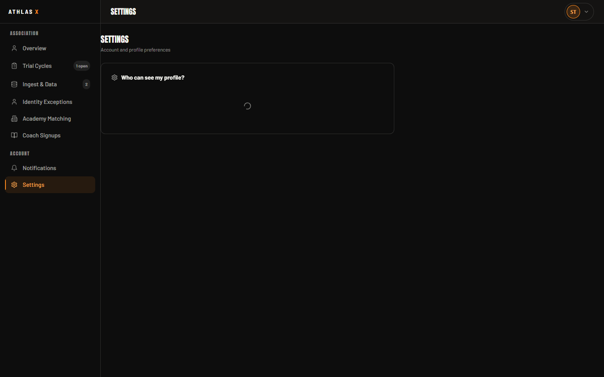

---

### `/ops/associations/new`, `/ops/associations/pending`, `/ops/scouts/pending`
**Role(s):** `athlasx_ops` — but **these three pages have no `layout.tsx` at all**, unlike every other route group. Gating is entirely client-side (`useSession()` check inside the page component itself), so an unauthorized visitor's browser still mounts the real page and renders an "Ops only" message, rather than getting a 404 before any client code runs. Real enforcement is still solid — it lives in the API routes (`requireRole(['athlasx_ops'])`), just not mirrored at the page shell like everywhere else.
- **`/ops/associations/new`** — Ops-only tool to create an Association + its first staff login directly (bypassing self-serve pending review), gated behind an explicit "I have personally verified a signed data-sharing agreement" checkbox.
- **`/ops/associations/pending`** / **`/ops/scouts/pending`** — Approve/Reject queues for self-serve signups, structurally identical to each other.

### `/association/pending`, `/scout/pending`
Standalone server components (not under `(dashboard)`). Each redirects a non-matching-role visitor to `/`, and redirects an already-approved account straight past the holding screen to the real dashboard — this page only ever actually renders for a signed-in, still-pending account of that specific role.

---

## Cross-cutting notes on the dashboard layer

- **Two coexisting visual systems**, same split as the onboarding layer: `academy/*`, `association`, `coach`, `scout`, `record`, `profile`, `notifications`, `settings` use the newer `ax-*` amber system; `dashboard`, `selection`, `grading`, `convergence`, `ingest`, `tracking`, `identity-exceptions`, `trial-cycles`, `academy-matching`, `coach-signups`, and all three `ops/*` pages use an older dark glass-card + green-accent system. Both render inside the same shell.
- **Inconsistent page-shell gating**: every route group has a real server-side `layout.tsx` gate except `/ops/**`, whose only gate is client-side (see above).
- **The same approve/reject queue pattern is repeated five times** with near-identical shape: `/academy/join-requests`, `/academy-matching`, `/identity-exceptions`, `/ops/associations/pending`, `/ops/scouts/pending`.
- **Two confirmed dead UI elements**: `/selection`'s candidate rows, `/trial-cycles`' "View registrations" button — both styled as clickable, neither wired to anything.
- **Blind boundaries (grading, coach evaluations) are enforced server-side only** — the client has no masking logic to misconfigure, because the restricted data simply isn't sent.

---

## 4. Backend — API Route Catalog

All 75 route files under `src/app/api/` were read in full. Grouped by area; **Method + Path | Auth | What it does | Notable checks**.

### `/api/auth/*`
- **`GET/POST /api/auth/[...nextauth]`** — NextAuth's own handler. `authorize()` → `authenticateWithPassword` (`src/lib/auth.ts`), which applies `rateLimit('login-password', email, 10, 900)` *before* even looking the user up.
- **`POST /api/auth/signup`** — public. Creates a bare `User` (no profile) for `player`/`coach`/`academy` roles only (`academy` additionally needs the self-serve flag). `rateLimit('bare-account-signup', email, 5, 3600)`, `validatePasswordStrength`, unique-violation → 409.

### `/api/player/*`
- **`POST /api/player/onboard`** — public, creates the account. Explicitly **rejects** any request carrying match-stat-shaped keys ("scores come from ingested scorecards only"). Both Aadhaar requestIds re-verified server-side via `consumeVerifiedAadhaar` (single-use). `rateLimit('player-onboard-signup', email, 5, 3600)`.
- **`GET/PATCH /api/player/visibility`** — self-only. `SELECTABLE_TIERS` deliberately excludes `franchise_scout` — can't be self-selected even by posting the raw enum string.

### `/api/coach/*`
- **`POST /api/coach/onboard`**, **`POST /api/coach/onboard/send-otp`**, **`GET /api/coach/onboard/associations`** — all public (pre-account).
- **`GET /api/coach/squad`** — `canAccessSquad`-checked when an explicit `squadId` is passed.
- **`POST /api/coach/[playerId]/evaluate`** — **`requireAuth` only. No role check, no ownership/squad check at all** — any authenticated account of any role can write an evaluation for *any* player in the system. Flagged in §5 as under-protected relative to its sibling `squads/[id]/advisory-notes` (which does check real squad membership).

### `/api/academy/*` (all gated by `academyGate()` → 404 if `ACADEMY_SELF_SERVE_ENABLED=false`)
16 routes covering batches (create/list, add/remove player), join requests (list/approve/reject), players (list/create/bulk-CSV up to 500 rows), dashboard, and public onboarding/OTP/lookup endpoints. `GET /api/academy/lookup` is deliberately exempt from the flag/gate — it serves the always-on player-onboarding wizard's academy search, not the admin surface.

### `/api/scout/*` (gated by `scoutGate()` → 404 if `SCOUT_SELF_SERVE_ENABLED=false`)
- **`GET /api/scout/candidates`** — double-gated: `FRANCHISE_SCOUT_ENABLED` off → empty array; `isScoutVerified(user)` false (unapproved profile) → also empty array, independent of the page-shell redirect.
- **`POST /api/scout/onboard`**, **`send-otp`** — public.

### `/api/association/*`, `/api/associations/*`
- **`GET /api/association/coaches`** — `association`/`athlasx_ops`, scoped.
- **`POST /api/associations/onboard`** — `athlasx_ops`-only, Ops-direct creation path.
- **`POST /api/associations/self-serve-onboard`** — public, creates with **explicit** `verification_status: 'pending'`.
- **`GET /api/associations`** — any authenticated role, no restriction (returns every association's name/state — low sensitivity but inconsistent with the rest of the association surface).
- **`GET /api/associations/state-list`** — deliberately public (feeds the district-signup parent-association picker).

### `/api/ops/*` (all `requireRole(['athlasx_ops'])`)
`PATCH .../verification` for both associations and scouts only ever accepts `approved`/`rejected` (never a way to write back to `pending`), 409s if the target isn't currently `pending`. `GET .../pending` list routes for each.

### `/api/grading/*` (blind-grading subsystem — several routes carry `T-GRADE-AUTH` comments documenting a prior privilege-escalation fix)
- **`POST /api/grading/[sessionId]/grade`** — `selector_id` derived from the session server-side, **never from the request body** (comment: "requireAuth alone let ANY authenticated user POST a grade" — a documented prior full-privesc bug, now fixed). Blocks writes once convergence is unlocked.
- **`POST .../lock-squad`, `POST .../unlock`** — chair-only, `chairId` derived from the session, checked against `session.chair_id`.
- **`GET .../mine`** — returns only the caller's own grades, `selectorId` derived from the session (not a query param — same class of fix).
- **`GET .../convergence`** — caller must be association-scoped staff, or the chair, or have actually submitted a grade in this session; refuses data until convergence is unlocked.

### `/api/identity-exceptions/*`
Confirm/Merge/Split — each requires the exception be `OPEN`, checks the caller's association scope against the exception's own `association_id`, and (confirm/merge) requires the target `playerId` be one of the exception's own listed candidates — never an arbitrary id.

### `/api/ingest/*`
- **`POST /api/ingest`** — caller-supplied `associationId` must be in the caller's own verified scope (403 otherwise).
- **`POST /api/ingest/[id]/decide`** — the real write path on approval: one transaction (20s timeout) creating Tournament/Match/Performance rows, routing ambiguous identity matches to `IdentityException` instead of guessing.

### `/api/squads/*`, `/api/tracking/*`, `/api/trial-cycles/*`, `/api/candidate-pool`, `/api/my-record`, `/api/dashboard`, `/api/claim/*`, `/api/onboarding/aadhaar/*`, `/api/academy-matching/*`
Full per-route detail (75 routes total) is preserved in the research transcript this document was built from; the highlights not already covered above:
- **`GET /api/tracking`** — comment documents a prior bug where `TrendAlert` joined straight to `PlayerProfile` with **no** visibility check at all ("ANY authenticated caller could see every association's flagged players") — now fixed via `visibilityWhere(scope)`.
- **`POST /api/tracking/[playerId]/note`** — same under-protection pattern as coach evaluate: `requireAuth` only, no ownership check, any authenticated user can attach a note to any player.
- **`GET /api/trial-cycles/[id]/registrations/[registrationId]/dossier`** — `requireAuth` only, **no association-scope check on the registration itself** — the exact bug class its sibling route (`.../registrations`) documents fixing one level up, but the fix wasn't carried down to this endpoint.
- **`POST /api/claim/search`** — public, **zero rate limiting** (its only sibling without one), can enumerate unclaimed shadow player profiles by name+district.
- **`/api/academy-matching/*`** (all 4 routes) — `requireAuth` only, no role restriction at all, unlike every comparable Ops-style review surface.

---

## 5. Security Mechanisms

### Authentication
`src/lib/auth.ts` — NextAuth, JWT session strategy (no DB session table), `CredentialsProvider` only. `pages.signIn: "/auth"` deliberately overrides NextAuth's default unstyled page so it's never reachable. `authenticateWithPassword` normalizes email, rate-limits (`login-password`, 10/15min, keyed by email — the login path previously had *no* rate limit at all, per the code's own comment, until this session added it), looks up the user, `bcrypt.compare`s.
`encodeSessionToken`/`applySessionCookie` let non-NextAuth routes (signup, claim-verify, every onboarding-completion route) mint a session cookie indistinguishable from a real NextAuth sign-in — same JWT claims, same cookie name (`next-auth.session-token`, `__Secure-` prefixed under HTTPS), `httpOnly`, `sameSite: lax`, 30-day `maxAge`.

### Password handling
`src/lib/password.ts` — bcrypt cost 10. `validatePasswordStrength`: 10+ chars, must contain a letter AND a digit, ~19-entry common-password blocklist (generic + site-specific like `athlasx123`). Enforced at exactly 7 account-creation call sites; **deliberately not re-checked at login** ("strength rules apply only at creation time," per the code's own comment).

### Rate limiting
`src/lib/rate-limit.ts` — in-memory sliding-window, `globalThis`-backed (survives Next.js dev-mode module reloads), **not Redis-backed** despite `@upstash/*` being installed as a dependency for a future swap. 19 call sites across the codebase, every bucket keyed by the identity being targeted (email/phone/requestId — never raw IP). Full bucket list: login (10/15min), 6 signup buckets (5/hr each), 6 OTP-send buckets (5/hr each), 5 OTP-verify buckets (10/hr each), claim-flow (5/hr send, 10/hr verify). **Gap**: `POST /api/claim/search` has zero rate limiting.

### Authorization / RBAC
`src/lib/require-auth.ts` — `requireAuth` (401 if no valid JWT cookie) / `requireRole(roles)` (403 if role not in the list) — the universal API pattern. Of 75 route files: 28 use `requireAuth` alone, 36 use `requireRole`, 21 have none (all pre-account/OTP/deliberately-public routes).

Two **verification-gate** modules layer approval-status checks on top of role checks:
- `src/lib/association/verification-gate.ts` — `resolveVerifiedAssociationScope()` filters to `verification_status: 'approved'` associations only. Imported by **20 files** — essentially every association-scoped route.
- `src/lib/scout/verification-gate.ts` — `isScoutVerified()`, single-row check (scout is 1:1 with its profile, no scope array needed). Imported by exactly the one route that actually serves scout-visible data (`GET /api/scout/candidates`) — correctly narrow.

### CSP & security headers
`next.config.mjs` — full CSP with a documented, code-verified rationale per directive (not boilerplate): `script-src 'self' 'unsafe-inline'` (Next's RSC hydration injects unnonced inline scripts — a real fix needs per-request nonces via middleware, which doesn't exist here) plus `'unsafe-eval'` in dev only (Fast Refresh needs it); `connect-src 'self'` (every client fetch is same-origin); `frame-src 'none'`, `object-src 'none'`, `frame-ancestors 'none'`. Plus `Strict-Transport-Security`, `X-Content-Type-Options: nosniff`, `X-Frame-Options: DENY`, `Referrer-Policy`, `Permissions-Policy`. Sentry's client reports are proxied through `/monitoring` (same-origin) specifically so `connect-src 'self'` never needs a third-party carve-out.

### Error monitoring (Sentry)
`instrumentation.ts` / `instrumentation-client.ts` / `sentry.server.config.ts` / `sentry.edge.config.ts` — added this session. Client init uses the current `@sentry/nextjs` v10 convention (not the deprecated `sentry.client.config.ts`). No DSN configured yet anywhere in `.env.local` — the SDK no-ops safely rather than throwing; real reporting activates the moment `NEXT_PUBLIC_SENTRY_DSN`/`SENTRY_DSN` are set. `error.tsx`/`global-error.tsx` both call `Sentry.captureException` on mount — live-verified working this session.

### Input validation
`zod` is an installed dependency but **imported nowhere in the codebase** (grep confirms zero matches) — every route validates manually (if-checks, digit-stripping regexes, type coercion). No single schema-validation layer exists; rigor varies route to route.

### Aadhaar identity verification
`src/lib/aadhaar-verification.ts` is an explicit **dev stub, not a real UIDAI/eKYC integration** — its own header comment says so, and the code proves it (the OTP code is generated locally and echoed straight back to the client, which no real vendor integration would ever do). This is disclosed upfront in the actual onboarding UI copy ("Dev mode — no eKYC vendor connected," code shown in plain text) — not hidden. This session corrected several places in the UI that previously overclaimed this as "independently verified" identity; the copy now says "OTP confirmed," matching what actually happened. Only the last 4 digits of any Aadhaar number are ever stored; the full number is never persisted.

### OTP flows (5 distinct implementations, all dev stubs — no SMS gateway wired anywhere)
| Flow | Storage | Dev code echoed to client? |
|---|---|---|
| Player claim (pre-auth, existing player) | DB-backed (`PhoneOtp` table) | **No** — console-logged only, never in the HTTP response |
| Scout / Academy / Coach onboarding | In-memory, `globalThis`-backed | Yes |
| Guardian consent (academy join-link) | In-memory, **plain module-level, not `globalThis`-backed** — inconsistent with every other in-memory OTP store | Yes |
| Aadhaar eKYC | In-memory, `globalThis`-backed, two-stage single-use consume | Yes |

### Known gaps (stated factually)
- **No password-reset flow exists anywhere.** The "Forgot password?" link on `/auth` is a toast notice ("isn't wired up yet"), not a real flow.
- **No dedicated CSRF middleware.** NextAuth's own `/api/auth/*` endpoints get its built-in CSRF cookie automatically; every route that mints a session *outside* the NextAuth handler (signup, claim-verify, every onboarding-completion route) relies solely on `sameSite: lax` as cross-site mitigation, with no application-level CSRF token of its own.
- **Under-protected write endpoints** (no rate limit, or a thinner-than-neighboring-routes auth check): `POST /api/coach/[playerId]/evaluate`, `POST /api/tracking/[playerId]/note` (both `requireAuth`-only with no ownership check), `GET /api/trial-cycles/[id]/registrations/[registrationId]/dossier` (no association-scope check), `/api/academy-matching/*` (no role check at all), `POST /api/claim/search` (no rate limit).

---

## 6. Database — Schema & Maintenance

**Full schema**: `prisma/schema.prisma`, 1221 lines, 40+ models, 37 enums, all pinned to a dedicated `"athlasx"` Postgres schema (never touching the legacy `public` schema, which may hold ~30 unrelated tables from an archived predecessor codebase). Every PK is a `gen_random_uuid()`-defaulted UUID.

**Model groups** (see the full inventory in the research transcript for every field): Users & roles (`User`, `UserRole` enum with 7 values) · Association & verification (`Association`, `AssociationStaff`, verification-status gating) · Academy & batches (`Academy`, `AcademyBatch`, `AcademyBatchMembership`, `AcademyJoinRequest`, `AcademyAttendanceFlag`, `AcademyMatchCandidate`) · Player profile & performance (`PlayerProfile` — the largest model, 40 fields — `PlayerClaim`, `PhoneOtp`, `Tournament`, `Match`, `Performance`) · Coach/squad/grading (`CoachProfile`, `Squad`, `SquadCoach`, `SquadPlayer`, `CoachAdvisoryNote`, `TrainingSession`, `SessionAttendance`, `SelectionSession`, `Grade`, `Selection`, `OmissionRationale`, `SelectorProfile`) · Trial cycles & registrations (`TrialCycle`, `TrialVenue`, `Registration`, `Dossier`) · Scout (`ScoutProfile`) · Identity resolution / ingest (`IdentityException`, `IngestJob`) · Weekly tracking (`PlayerWeek`, `TrendAlert`).

**No `prisma/migrations/` directory exists at all** — schema state is pushed directly (`prisma db push`), never tracked via `prisma migrate`. Instead, `prisma/manual_migrations/*.sql` (7 files) are hand-written, forward-only SQL scripts applied via `npx prisma db execute --file ... --url "$DATABASE_DIRECT_URL"` (never the pooled URL — DDL needs the direct connection). This convention exists because: (1) there's no migration history to build on, (2) tooling in this environment can't always reach the DB host or Prisma's binary CDN directly, so changes get handed over as a runnable SQL file, (3) `DATABASE_DIRECT_URL` vs. pooled `DATABASE_URL` discipline needs to be explicit per-invocation, (4) schema changes require a reviewable diff and explicit human go-ahead as a standing project rule. **No `IF NOT EXISTS` guards** exist in these files — a partial failure mid-file can leave the DB half-applied; don't blind-retry a failed `CREATE TYPE`/`CREATE TABLE`.

**Connection**: `src/lib/db.ts` — the standard Next.js Prisma singleton (`globalThis`-stashed outside production) to survive dev-mode hot-reload without exhausting the connection pool. `schema.prisma`'s datasource block uses **both** `url` (pooled, Supabase Supavisor, `:6543`, all runtime queries) and `directUrl` (unpooled, `:5432`, schema/DDL operations only) — transaction-mode poolers don't support the session-level features DDL needs.

**Test isolation**: `scripts/setup-test-db.mjs` derives a parallel `prisma/schema.test.prisma` (generated, git-ignored, banner says "do not edit") with every `@@schema("athlasx")` rewritten to `@@schema("athlasx_test")`, plus a distinct generated-client output path so it can never shadow the real `@prisma/client`. Self-checks refuse to continue if the rewrite didn't actually happen. `npm run test:setup-db` / `test:teardown-db` drive it; CI runs setup but **never runs teardown** — a documented, accepted risk (two CI runs racing the same shared schema) at this repo's current PR cadence.

**Seed data**: `prisma/seed.ts` (202 lines) — one association (UPCA), a chair + second selector (`selection_panel`) + association staff, all password-hashed with a shared dev constant; three "shadow" player profiles (never logged in); a trial cycle + grading session with one seeded `Grade` (deliberately demonstrating the blind-grading boundary); an academy + fuzzy-match candidates; hand-authored `PlayerWeek` rows tracing an explicit declining curve (73→71→68→65) and rising curve (68→74→77→82) across 4 weeks, feeding two `TrendAlert` rows — built specifically to make the trend-alert feature demoable without waiting for real weekly data; 4 `IngestJob` rows spanning every status value.

**Backup/maintenance**: **No backup script, cron job, or scheduled workflow exists anywhere in this repository.** The only mention of backups at all is one advisory line in a fix doc suggesting a Supabase point-in-time-recovery snapshot before applying schema changes — not an automated practice. Row-Level Security is mentioned exactly once, as an illustrative code sample in an architecture doc for a table that doesn't exist in the real schema — RLS is not enabled anywhere in the live database; every access control is enforced in application code (see §5).

**Data-integrity invariants enforced only in application code, not the DB** (worth knowing before writing any new query or migration): the association/scout verification gate itself (nothing in the DB ties `verification_status` to what a query is allowed to return — it's a wrapper-module convention, not a constraint); several `Uuid` fields that look like foreign keys but have no actual DB `@relation` (`User.linked_player_id`, `SelectionSession.chair_id`, `Selection.player_id`, and others); `PlayerProfile.batch_id`/`batch_label` are meant to be XOR but nothing enforces that; the blind-grading boundary is entirely an API-routes convention with zero DB enforcement (any direct query against `grades` sees everything); `AssociationVerificationStatus`'s DB-level default is `'approved'` — only the self-serve code path explicitly overrides it to `'pending'`, so any other future insert path that forgets this will silently create a pre-approved association.

---

## 7. Git History — Feature-Area Commit Log

The 90-file backlog of uncommitted work accumulated across this engagement was split into 18 separate, feature-scoped commits this session (in dependency order — foundational pieces like password validation landing before the features that depend on them):

```
5b01f06 feat: add error/not-found boundaries, route loading skeletons, and Sentry
6440e9f fix: remove features grid from landing page hero
5ed6db0 fix: hide redundant brandmark in dashboard top bar at lg+ widths
08fb9a6 fix: raise --ax-text-faint contrast to meet WCAG AA
cec6704 chore: remove unused AADHAAR_HMAC_SECRET and NEXT_PUBLIC_APP_URL from env template
1046568 chore: add manual migration SQL to catch up DB schema with committed models
f71d131 feat: compress academy onboarding wizard from 5 steps to 3
69f5a8f feat: pin feature flags to confirmed 2026-09-11 launch values
d17066b feat: compute real weekly scores and TrendAlert detection on evaluate
c8fb73b fix: apply password-strength validation and rate-limiting to academy signup
b076861 fix: remove NextAuth's default sign-in page, route to /auth instead
91b2440 feat: add Scout verification gate with Ops review queue
eb00e01 feat: create bare account before onboarding wizard for player/coach sign-up
db874b1 feat: add RingGauge and real trend/capacity data to dashboards
8d9a3ce fix: scope dashboard aggregate counts to the requesting association
608139a fix: enforce association-verification gate on every association-scoped route
95a63b1 feat: add association self-serve onboarding with Ops verification gate
a8b7a00 fix: stop overclaiming Aadhaar as independently verified identity
e4e2fb3 feat: add server-side password-strength validation and signup rate-limiting
```

**Preceding history** (already committed before this session's split):

```
de48a8b fix: route onboarding completion through rootDestination(); add Scout self-serve
f2969e2 feat: security hardening, page-level auth gates, dashboard fixes, and academy/coach onboarding work
441e64a Merge pull request: design system, onboarding restyles, and trust/correctness fixes
8ad5f52 test: truncate academy batch/attendance/join-request tables in resetDb
90bdbd6 feat: add academy_admin role and Ops/Academy nav sections
7d81314 feat: show cohort percentile on the player record page
23f77a0 fix: gate academy onboard/send-otp routes behind the self-serve flag
69ff970 fix: require athlasx_ops auth for association onboarding
177795f feat: add academy self-serve feature flag and its request gate
30d1072 feat: restyle academy onboarding and remove association self-serve UI
29637f1 feat: register orange/black design-system tokens and shared components
871b5b9 feat: restyle coach and association onboarding to the orange/Anton-Barlow palette
249978c feat: two-column rail layout + localStorage resume for player onboarding
f45bf2a feat: restyle player onboarding to the orange/Anton-Barlow palette
0d19f74 feat: restyle landing page and auth page to match the Hero/Auth mockups
fd084df feat: add self-serve coach onboarding flow
b483f87 feat: implement academy onboarding flow with consistent design tokens
812e6f7 feat: add self-serve association onboarding
18c953e feat: rebuild player onboarding as a 3-stage flow with Aadhaar verification (stubbed) and per-consent scroll-gated acceptance
a7f9ca2 feat: add role-selection auth/sign-up landing page
b625adb feat: add highlighted wordmark treatment to the hero AthlasX mark
```

Run `git log --oneline` for the complete, current history — this list reflects the state as of this document's generation and will fall out of date.

---

## 8. Known Gaps & Miscellaneous Notes

- **Test accounts used for the live walkthrough**: `staff@upca.example` (association, real seeded data) and `chair@upca.example` (selection_panel) both come from `prisma/seed.ts`'s documented dev password. Only `staff@upca.example` actually authenticated during this pass — `chair@upca.example`'s current live password no longer matches the seed script's constant (real "Incorrect email or password" returned), so the selection/grading/convergence screenshots were captured under the association account instead, which the API confirms has legitimate access to all three pages.
- **Resetting other test accounts was deliberately not done.** Several `@test.local` "audit-*" accounts exist across every role (clearly earlier test fixtures from this same engagement) — resetting their passwords to inspect their dashboards was attempted and **blocked by this session's own auto-mode safety classifier** as a live credential-modification action on a shared database. That block was respected rather than worked around.
- **No fresh player/coach/scout/academy_admin accounts were created via the real signup wizards** in this pass, so `/record`, `/coach`, `/scout`, and the `/academy/**` group have no live screenshot in this document — they are documented exhaustively from source instead (every field, every button, every API call), and a live screenshot of `/scout` specifically was visually confirmed correct earlier in this session via a separate, pre-existing logged-in session, just not saved as a file here.
- **The `academy_admin` self-serve flag is off** (`ACADEMY_SELF_SERVE_ENABLED=false`), so the entire `/academy/**` route group is currently unreachable in production even by an `academy_admin` account — confirmed launch decision, not a bug.
- **A stray backup file exists**: `src/app/academy/onboarding/page.tsx.5step.bak` — the pre-compression version of the academy wizard, left uncommitted and unused; not part of the routed app.
- **Reference prompt/audit documents** exist under `docs/*.md` and `Claude outputs/*.md` (engagement context summaries, earlier UI audits, fix-plan prompts) — left as-is, not folded into this reference document, since they're process artifacts rather than product documentation.

---

## Appendix A — Every API Route (complete list, all 75)

§4 covered the routes with the most interesting behavior in prose. This table is the complete list, so nothing is left undocumented, however routine.

| Method + Path | Auth | One-line description |
|---|---|---|
| `GET/POST /api/auth/[...nextauth]` | NextAuth Credentials | Sign-in; `authenticateWithPassword` + rate limit |
| `POST /api/auth/signup` | public | Bare account (player/coach/academy) |
| `POST /api/player/onboard` | public | Creates player account + profile, Aadhaar re-verified server-side |
| `GET/PATCH /api/player/visibility` | requireAuth, self-only | Read/update own visibility tier |
| `POST /api/coach/onboard` | public | Creates coach account + profile |
| `POST /api/coach/onboard/send-otp` | public | Sends coach phone OTP |
| `GET /api/coach/onboard/associations` | public | Association picker list for coach signup |
| `GET /api/coach/squad` | requireAuth | Own squad roster + 8-week score trend |
| `POST /api/coach/[playerId]/evaluate` | requireAuth only (no ownership check) | Fitness/behaviour rating + note, triggers TrendAlert |
| `GET/POST /api/academy/batches` | academyGate + academy_admin | List/create batches |
| `GET/POST /api/academy/batches/[batchId]/players` | academyGate + academy_admin | List/assign batch roster |
| `DELETE /api/academy/batches/[batchId]/players/[playerId]` | academyGate + academy_admin | Remove player from batch |
| `GET /api/academy/dashboard` | academyGate + academy_admin | Dashboard stats, trend, capacity |
| `GET/POST /api/academy/join-requests` | academyGate + academy_admin | List pending join requests |
| `POST /api/academy/join-requests/[requestId]/approve` | academyGate + academy_admin | Approve into a batch |
| `POST /api/academy/join-requests/[requestId]/reject` | academyGate + academy_admin | Reject join request |
| `GET /api/academy/join/[academyId]` | academyGate, public | Public academy lookup for invite link |
| `POST /api/academy/join/[academyId]/send-otp` | academyGate, public | Guardian consent OTP send |
| `POST /api/academy/join/[academyId]/submit` | academyGate, public | Submit pending join request |
| `GET /api/academy/lookup` | public, no gate | Academy name search for player onboarding |
| `POST /api/academy/onboard` | academyGate, public | Creates academy_admin account + Academy |
| `POST /api/academy/onboard/send-otp` | academyGate, public | Academy signup phone OTP |
| `POST /api/academy/players/bulk` | academyGate + academy_admin | CSV bulk player import (max 500 rows) |
| `GET/POST /api/academy/players` | academyGate + academy_admin | List/create players directly |
| `GET/POST /api/academy/attendance-flags/[playerId]` | academyGate + academy_admin | Attendance follow-up status/action |
| `GET /api/academy-matching` | requireAuth (no role check) | List fuzzy academy-match candidates |
| `POST /api/academy-matching/[id]/confirm` | requireAuth (no role check) | Confirm a fuzzy match |
| `POST /api/academy-matching/[id]/reject` | requireAuth (no role check) | Reject a fuzzy match |
| `GET /api/academy-matching/production` | requireAuth (no role check) | Academy production leaderboard |
| `GET /api/scout/candidates` | requireRole(scout, athlasx_ops) + scout verification gate | Franchise-visible player candidates |
| `POST /api/scout/onboard` | scoutGate, public | Creates scout account + profile (pending) |
| `POST /api/scout/onboard/send-otp` | scoutGate, public | Scout signup phone OTP |
| `GET /api/association/coaches` | requireRole(association, athlasx_ops) | Coaches who named this association |
| `POST /api/associations/onboard` | requireRole(athlasx_ops) | Ops-direct association + staff creation |
| `GET /api/associations` | requireAuth (no role check) | List every association (name/state) |
| `POST /api/associations/self-serve-onboard` | public | Self-serve association signup (pending) |
| `GET /api/associations/state-list` | public | State-level associations for parent picker |
| `PATCH /api/ops/associations/[id]/verification` | requireRole(athlasx_ops) | Approve/reject pending association |
| `GET /api/ops/associations/pending` | requireRole(athlasx_ops) | List pending associations |
| `PATCH /api/ops/scouts/[id]/verification` | requireRole(athlasx_ops) | Approve/reject pending scout |
| `GET /api/ops/scouts/pending` | requireRole(athlasx_ops) | List pending scouts |
| `GET /api/grading/[sessionId]/convergence` | requireRole(selection_panel, association, athlasx_ops) + scope | Aggregated per-player grade view |
| `POST /api/grading/[sessionId]/grade` | requireRole(selection_panel) | Submit own grade, selector_id server-derived |
| `POST /api/grading/[sessionId]/lock-squad` | requireRole(selection_panel), chair-only | Finalizes Selection rows |
| `GET /api/grading/[sessionId]/mine` | requireRole(selection_panel) | Caller's own submitted grades only |
| `POST /api/grading/[sessionId]/unlock` | requireRole(selection_panel), chair-only | Unlocks convergence view |
| `GET /api/grading/session` | requireRole(selection_panel, association, athlasx_ops) | Most recent visible session + roster |
| `GET /api/identity-exceptions` | requireRole(association, athlasx_ops) | List open identity exceptions |
| `POST /api/identity-exceptions/[id]/confirm` | requireRole(association, athlasx_ops) | Attach performance to chosen candidate |
| `POST /api/identity-exceptions/[id]/merge` | requireRole(association, athlasx_ops) | Same, marks MERGED |
| `POST /api/identity-exceptions/[id]/split` | requireRole(association, athlasx_ops) | Creates a new shadow profile |
| `GET /api/ingest` | requireRole(association, athlasx_ops) | List ingest jobs |
| `POST /api/ingest` | requireRole(association, athlasx_ops) | Submit a new ingest job |
| `POST /api/ingest/[id]/decide` | requireRole(association, athlasx_ops) | Approve/reject — approval is the real write path |
| `POST /api/onboarding/aadhaar/initiate` | public | Send Aadhaar OTP (dev stub) |
| `POST /api/onboarding/aadhaar/verify` | public | Verify Aadhaar OTP |
| `GET/POST /api/squads` | requireAuth, scope-derived | List/create squads |
| `GET /api/squads/[id]` | requireAuth + canAccessSquad | Squad detail + roster |
| `GET/POST /api/squads/[id]/advisory-notes` | requireAuth + canAccessSquad | Coach advisory notes (fitness/behaviour/note) |
| `POST /api/squads/[id]/coaches` | requireAuth, scope-derived | Assign a coach to a squad |
| `GET/POST /api/squads/[id]/sessions` | requireAuth + canAccessSquad | Training sessions |
| `GET/POST /api/squads/[id]/sessions/[sessionId]/attendance` | requireAuth + canAccessSquad | Bulk attendance marking |
| `GET /api/tracking` | requireAuth | Players with active TrendAlerts, visibility-filtered |
| `POST /api/tracking/[playerId]/note` | requireAuth only (no ownership check) | Attach a coach note to latest PlayerWeek |
| `GET /api/trial-cycles` | public | List all trial cycles |
| `POST /api/trial-cycles` | requireAuth, scope-derived | Create a trial cycle + venues |
| `GET /api/trial-cycles/mine` | requireRole(association, athlasx_ops) | Own-region cycles + trend |
| `POST /api/trial-cycles/[id]/register` | requireAuth, self-only | Player self-registers into a cycle |
| `GET /api/trial-cycles/[id]/registrations` | requireAuth, scope-checked | List registrants for a cycle |
| `GET /api/trial-cycles/[id]/registrations/[registrationId]/dossier` | requireAuth only (no scope check) | Generated performance dossier |
| `GET /api/candidate-pool` | requireAuth, scope-derived | Scored roster for the latest selection session |
| `GET /api/my-record` | requireAuth, self-only | Caller's own player record |
| `GET /api/dashboard` | requireRole(association, selection_panel, coach, athlasx_ops) | Cross-role pipeline overview |
| `POST /api/claim/search` | public, **no rate limit** | Search unclaimed shadow player profiles |
| `POST /api/claim/start` | public | Begin claim, sends DB-backed OTP |
| `POST /api/claim/verify` | public | Verify OTP, creates player account |
| `POST /api/claim/withdraw` | requireAuth, ownership-checked | Withdraw consent on own claim |
