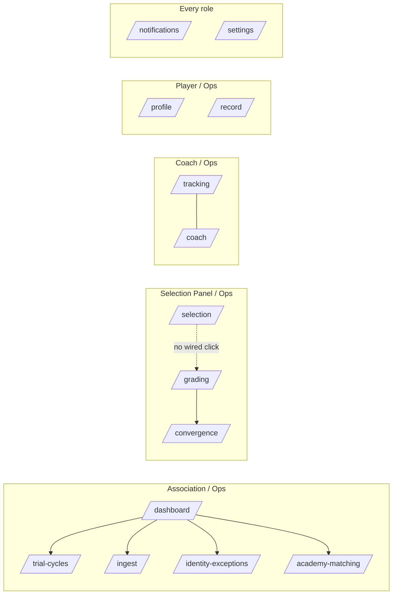

# AthlasX — Design Consistency, Frontend↔Backend Call Map & Page Flow

_Read directly against the live `main` branch via the same device bridge used for the earlier documents. Confidence tags: [Certain] = verified by direct grep/read against the current code, [Likely] = strong inference from that evidence, [Guessing] = filling a gap the code doesn't answer._

## 0. Status check — five of the six pivot prompts are already shipped

Before anything else: the git log shows Groups A, B, C, and E from `AthlasX_Pivot_Flow_and_Prompts.md` have already been run locally, in this order —

```
a9f2c18 fix: route signed-in users to their role's home page instead of unconditionally to /dashboard   (Group A)
fa881a7 feat: add identity exception review page for association staff                                   (Group B)
14156a5 feat: add player-facing visibility control (W6)                                                  (Group C, item 1 of 3)
4b3ef78 feat: replace stub notifications with a real trial-cycle feed (W6)                               (Group C, item 2 of 3)
1adb27b feat: surface coach advisory notes and trend flags as read-only context in the grading Quick View (Group E)
```

**Group C is two-thirds done, not finished** [Certain] — I grepped `/record`'s page and `/api/my-record` for `percentile` and found nothing. The visibility control and the notifications feed exist; cohort percentile on the player's own record page does not. Worth knowing before you assume that group is closed out.

`page.tsx`'s redirect now correctly reads `rootDestination(session)` from `chrome.ts` (`player → /record`, `coach → /coach`, `association`/`athlasx_ops` → `/dashboard`, `selection_panel → /selection`) instead of the old unconditional `/dashboard`. That bug is actually closed, not just patched around.

## 1. Three things worth knowing before the detail

You asked for design consistency and page-linkage as if they're two separate questions. They're not — the audit below shows they're the same failure wearing two hats: there is no shared button component and no shared data-fetching pattern anywhere in the authenticated app, so every page reinvents both its own look and its own click-wiring from scratch. That's exactly the kind of gap a dead click slips through unnoticed.

1. **[Certain] `/selection`'s candidate rows are styled as clickable and wired to nothing.** The row has `cursor-pointer`, a hover border transition, and a `group` class (used elsewhere to reveal hover-state children) — every visual signal of "click me to go to grading." There is no `onClick`, no `<Link>`, no `router.push` anywhere on that element (verified by grep against the full file). A user who tries the obvious interaction gets nothing. `/grading`'s own player list is the only way in today.
2. **[Certain] There are at least three different "primary confirm" button treatments** doing the same semantic job (commit an action) with no shared component behind any of them: `/grading`'s grade-submit is solid `bg-green-600 hover:bg-green-500` at `rounded-xl`/`py-2.5`; `/identity-exceptions`'s Confirm is a tinted outline `bg-green-500/10 border-green-500/25 text-green-400` at `rounded-lg`/`py-1.5`; `/ingest`'s Sync is `bg-green-600/80 hover:bg-green-600` at `rounded-xl`/`py-2`. Three different opacities, two different corner radii, two different paddings, for the same button role.
3. **[Certain] The sidebar's badge counts are hardcoded strings, not live data.** `NAV_SECTIONS` in `src/lib/chrome.ts` has `badge: '1 open'` on Trial Cycles, `badge: '2'` on Ingest & Data, `badge: '2 flags'` on Weekly Tracking, `badge: '3'` on Notifications — literal text in the nav config, never computed from a query. They look like live counters. They are decoration.

## 2. Design system consistency audit

### 2.1 Color — one token exists, almost nothing uses it

`globals.css` defines exactly two CSS custom properties meant to be the app's design tokens:

```css
:root {
  --ax-bg: #050505;
  --ax-green: #22c55e;
}
```

[Certain] `bg-[#050505]` (the literal hex, not `var(--ax-bg)`) is repeated verbatim in four separate files: `src/app/(dashboard)/layout.tsx`, `src/app/player/onboarding/page.tsx`, `src/app/claim/page.tsx`, and implicitly via `html, body { background: var(--ax-bg) }` in globals.css itself — meaning the token is correctly used exactly once, at the root, and then re-typed as a raw hex everywhere else that happens to need the same color.

[Certain] `#22c55e` (the brand green — same value as `--ax-green`) is hand-typed as a raw literal at least 15 separate times across `record/page.tsx`, `dashboard/page.tsx`, and `tracking/page.tsx` alone — chart strokes, gradient stops, KPI accent colors, a status-color ternary. None of them reference `var(--ax-green)`. If the brand color ever changes, that's a find-and-replace across three files with recharts inline-style props, not a one-line edit to `globals.css`.

Beyond the brand green, `record/page.tsx` and `dashboard/page.tsx` each freehand a small, slightly different palette of semantic accent colors inline (`#3b82f6` blue, `#f59e0b` amber, `#f87171` red/coral, `#8b5cf6` violet, `#06b6d4` cyan) — none declared anywhere as tokens, each just typed at the call site where a KPI tile or chart needed a color.

### 2.2 Components — two systems, split cleanly along the auth boundary

[Certain] The shared `Button`/`Input`/`Label` primitives (`src/components/ui/*.tsx`, shadcn-style `forwardRef` + `cn()` variants) are imported by exactly two files: `src/app/claim/page.tsx` and `src/app/player/onboarding/page.tsx` — both pre-auth flows. Every one of the 14 authenticated `(dashboard)` pages uses raw `<button>` elements instead, each hand-styled inline. Counted occurrences of raw `<button` in the dashboard route group: 34 across 13 files (`ingest` 7, `trial-cycles` 6, `tracking` 4, `academy-matching` 4, `identity-exceptions` 3, `grading` 3, `convergence` 3, `coach` 2, plus one each in `dashboard`, `selection`, `settings`, and both `[id]/register` and `[id]/dossiers` client components).

That's not an oversight in one file — it's a consistent boundary. Pre-auth uses the component library; the entire authenticated product does not. If you want one place to change what a button looks like across the signed-in app, it doesn't exist yet.

### 2.3 Surface treatment — the one pattern that actually holds

[Certain] `.glass` / `.glass-card` / `.glass-dark` (all defined once in `globals.css`) are used across 18 of the 19 `page.tsx`/client-component files in the app — the one file that doesn't is the pre-auth `HeroLanding` marketing component, which has its own visual language by design. This is the single genuinely consistent design decision in the codebase: every authenticated surface, and `/claim`, uses the same three-tier glass system for card backgrounds. Worth naming explicitly so it isn't accidentally "fixed" into something else later.

### 2.4 Corner radius — a scale exists in practice, not in config

`rounded-xl` (111 uses) dominates, with `rounded-lg` (33), `rounded-full` (23, avatars/pills — correct use), and `rounded-2xl` (23, mostly modal containers) as secondary tiers, plus one-off `rounded-t`, `rounded-r`, and `rounded-md`. The 3-tier pattern (`lg` small controls / `xl` cards / `2xl` modals) is real and mostly followed — but it lives entirely in muscle memory, not in `tailwind.config.ts`, which is currently:

```ts
theme: { extend: {} }
```

[Certain] Empty. No custom colors, spacing, radii, or font sizes are registered anywhere in the Tailwind config. Every "token" in this app — the radius scale, the accent colors, the glass surfaces — is either a CSS custom property in `globals.css` (2 of them) or an unwritten convention enforced only by whoever copy-pastes the last file's classes into the new one. That's why finding #2 above (three different confirm-button styles) was possible in the first place: there's no config-level guardrail that would have made them the same by default.

## 3. Frontend ↔ backend call map

No page in this app uses a shared API client, SWR, React Query, or any data-fetching abstraction — every page hand-rolls its own `useEffect` + `fetch` + `useState` loading/error triad independently [Certain, verified by absence: no `swr`/`@tanstack/react-query` in `package.json`, no `src/lib/api-client.ts` or equivalent]. That's consistent across the app in the sense that everyone does it the same *wrong* way, not in the sense that it's centralized anywhere.

| Page | Calls | Notes |
|---|---|---|
| `/` | none | Server component; only reads the session |
| `/claim` | `POST /api/claim/search`, `POST /api/claim/start`, `POST /api/claim/verify` | Linear step machine, one call per step |
| `/player/onboarding` | `POST /api/player/onboard` | Single submit; on success `router.push('/record')` — correctly updated from the old `/dashboard` target |
| `/dashboard` | `GET /api/dashboard` | Single fetch, all widgets render off one payload |
| `/trial-cycles` | `GET /api/trial-cycles`, `GET /api/associations`, `POST /api/trial-cycles` | Assumes single-association scope (`associations[0].id`) |
| `/trial-cycles/[id]/register` | `GET /api/trial-cycles` (finds own cycle client-side), `POST /api/trial-cycles/[cycleId]/register` | No dedicated single-cycle GET endpoint used |
| `/trial-cycles/[id]/dossiers` | `GET /api/trial-cycles/[cycleId]/registrations`, `GET /api/trial-cycles/[cycleId]/registrations/[registrationId]/dossier` | Master/detail, second call lazy on row select |
| `/ingest` | `GET /api/ingest`, `POST /api/ingest`, `POST /api/ingest/[jobId]/decide` | |
| `/identity-exceptions` | `GET /api/identity-exceptions`, `POST /api/identity-exceptions/[id]/[action]` | `action` is `confirm`/`merge`/`split`, interpolated into the URL itself |
| `/academy-matching` | `GET /api/academy-matching`, `GET /api/academy-matching/production`, `POST /api/academy-matching/[id]/confirm`, `POST /api/academy-matching/[id]/reject` | Two independently-loaded tabs |
| `/selection` | `GET /api/candidate-pool` | Single fetch, all filtering client-side; **no navigation call at all on row click — see finding #1** |
| `/grading` | `GET /api/grading/session`, `GET /api/grading/[sessionId]/mine`, `POST /api/grading/[sessionId]/grade`, `POST /api/grading/[sessionId]/unlock` | `/api/grading/session` now also returns the read-only advisory fields added in commit `1adb27b` |
| `/convergence` | `GET /api/grading/session`, `GET /api/grading/[sessionId]/convergence`, `POST /api/grading/[sessionId]/lock-squad` | Gated on `session.convergence_unlocked_at` before the second call fires |
| `/tracking` | `GET /api/tracking` | Single fetch, `DeepView` slide-over reads from the same payload, no second call |
| `/coach` | `GET /api/coach/squad`, `POST /api/coach/[id]/evaluate` | |
| `/profile` | none | Pure `useSession()` read |
| `/record` | `GET /api/my-record` | No percentile field in the response — see §0 |
| `/notifications` | `GET /api/trial-cycles`, `GET /api/my-record` | Reuses two existing endpoints rather than a dedicated notifications route; filters eligibility client-side from DOB |
| `/settings` | `GET /api/player/visibility`, `PATCH /api/player/visibility` | Optimistic update (sets local state before the PATCH resolves) with rollback on failure |

## 4. Page-to-page navigation map

### 4.1 Entry points

```
Signed out  → /  → HeroLanding → "Sign in" → /api/auth/signin?callbackUrl=/dashboard
Signed in   → /  → redirect(rootDestination(session)):
                     player          → /record
                     coach           → /coach
                     association     → /dashboard
                     athlasx_ops     → /dashboard
                     selection_panel → /selection
No account, has a shadow profile → /claim → (search → select → details → OTP) → signed in → link to /record
No account, no shadow profile    → /player/onboarding → 4-step wizard → POST /api/player/onboard → router.push('/record')
```

### 4.2 Nav-driven graph (from `NAV_SECTIONS`, the single source of truth for sidebar links)



The dotted edge is finding #1 — it's what the UI implies, not what the code does.

### 4.3 In-page cross-links (outside the sidebar)

- `/dashboard` → `/trial-cycles` (two separate links: pipeline row + a KPI tile), `/dashboard` → `/tracking` (one link)
- `/notifications` → `/trial-cycles/[id]/register` (per eligible cycle, the only place this registration route is actually linked *to* — it has no nav entry of its own by design, since it's a per-cycle deep link)
- `/claim` → `/` (cancel) and `/claim` → `/record` (post-claim success link)
- `/player/onboarding` → `/` (cancel) and `/player/onboarding` → `/claim` ("already have a profile?" escape hatch) and, on submit success, `router.push('/record')`
- `DashboardSidebar` → `/` (the brand mark, top of the sidebar, doubles as a home link) and → `/api/auth/signin` (sign-out target)

### 4.4 Reachability check

Every current `page.tsx` is reachable by at least one of: a nav item, an in-page `Link`, or a direct auth redirect. No orphaned pages today — the two dynamic `trial-cycles/[id]/*` routes are intentionally nav-free (they're per-record deep links, correctly reached only from `/trial-cycles` and `/notifications` respectively), and `/claim` + `/player/onboarding` are intentionally outside the authenticated sidebar since they're pre-account flows. The one broken edge is the click-through gap in §4.2, which is a wiring bug, not a reachability bug — `/grading` is still reachable from the sidebar directly.

## 5. If you want this fixed

The three findings in §1, plus the missing `/record` percentile from §0, are small, independent Claude Code prompts — none of them touch the score engine or auth chokepoints, unlike the earlier gap-remediation work. Say the word and I'll write them the same way as the last two batches.
