# AthlasX — Onboarding Screenshot Documentation

Captured via Playwright against the local dev server (`npm run dev`, `localhost:3000`), driving each wizard with realistic test data and the dev-mode OTP bypass (no SMS/eKYC gateway is configured locally, so the app renders the real verification code inline instead of sending it — this is expected local behavior, not a bug).

Academy onboarding was **not** walked: `ACADEMY_SELF_SERVE_ENABLED` is currently `false` in `src/lib/feature-flags.ts`, so `/academy/onboarding` is not a live signup path. Per instruction, it was not forced open for this pass.

Association has no onboarding wizard (Ops-mediated, notice page only) and was out of scope here.

---

## Player — `/player/onboarding`

Three stages: Basic Details → Aadhaar Verification → Footage, Bio & Consent.

### 1. Stage 1 of 3 — Basic Details (blank)
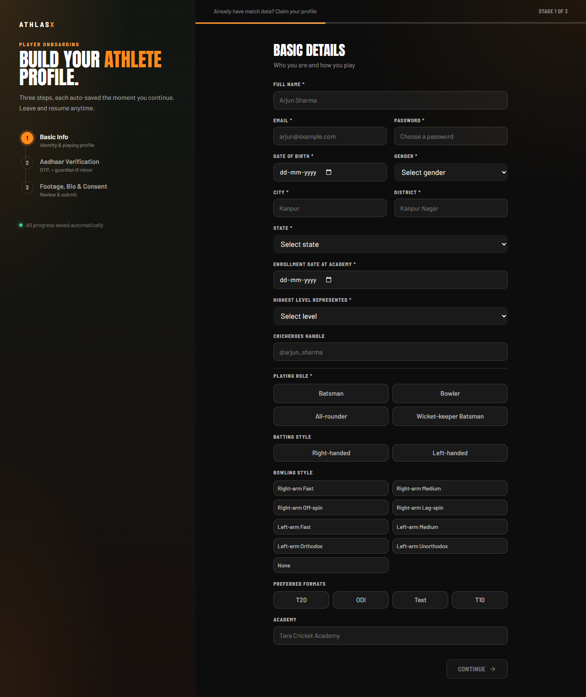
First load. Full name, email, password, DOB, gender, city, district, state, academy enrollment date, highest level represented, CricHeroes handle (optional), playing role, batting style, bowling style, preferred formats, and academy name.

### 2. Stage 1 of 3 — Basic Details (filled)
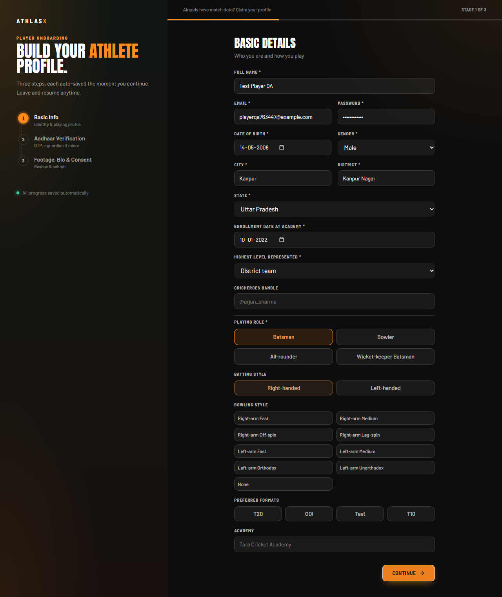
Filled with realistic test data (Test Player QA, Uttar Pradesh / Kanpur, District-team level, Batsman/Right-handed) immediately before clicking Continue.

### 3. Stage 2 of 3 — Aadhaar Verification (entry state)
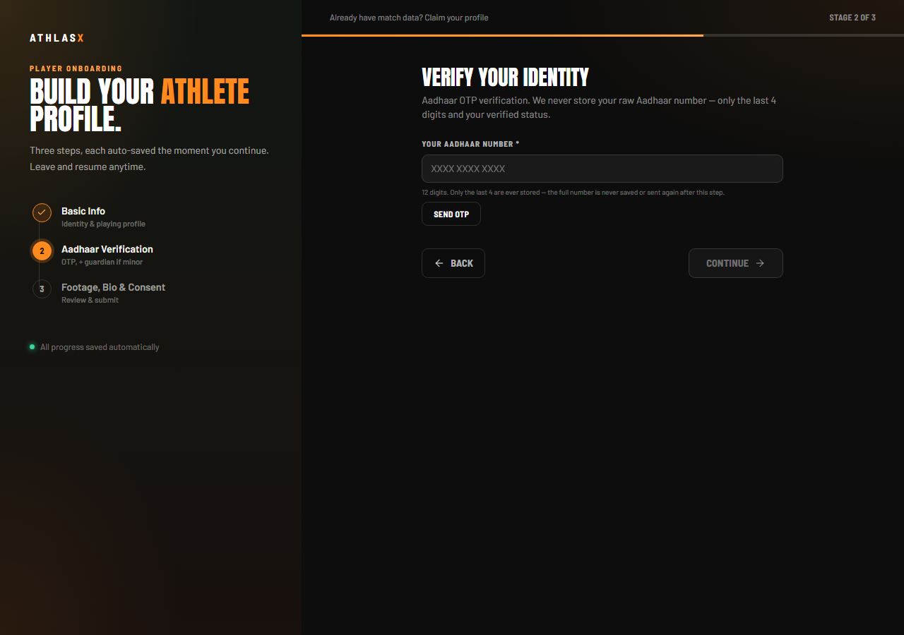
Landed here after Stage 1. Copy clarifies only the last 4 digits of the Aadhaar number are ever stored — the full number isn't saved or resent after this step.

### 4. Stage 2 — after "Send OTP"
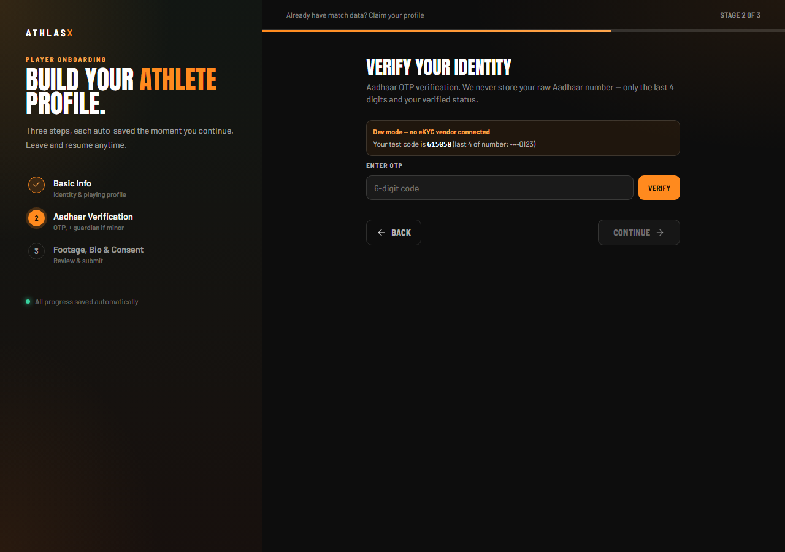
Dev-mode banner: "Dev mode — no eKYC vendor connected," with the real generated code shown inline for local testing, plus the masked last-4 confirmation and a 6-digit OTP entry field with a Verify button.

### 5. Stage 2 — after Verify
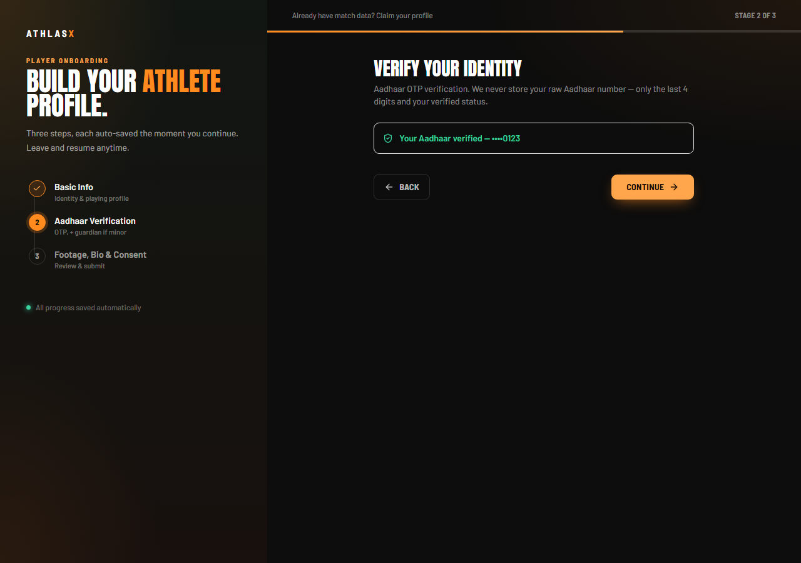
Aadhaar shows verified (masked last 4), Continue button becomes active (orange, enabled).

**Unexpected state hit along the way:** clicking Continue on Stage 2 *before* completing OTP verification doesn't just block navigation — it resets the Aadhaar field entirely back to the empty "enter 12 digits" state and surfaces a validation error ("Enter all 12 digits"), discarding whatever partial progress existed in that block. Worth confirming this is the intended UX rather than a state bug, since it reads as "you lost your progress" rather than "please finish this step."

### 6. Stage 3 of 3 — Footage, Bio & Consent
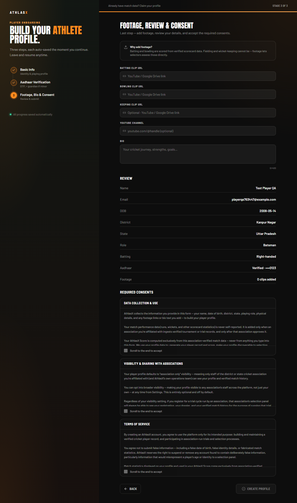
Final step: optional batting/bowling/keeping clip URLs, YouTube channel handle, bio (0/400 chars), a Review panel echoing back submitted values (Name, Email, DOB, District, State, Role, Batting, Aadhaar verification status, footage count), and three required consent panels (Data Collection & Use, Visibility & Sharing with Associations, Terms of Service) — each requires scrolling to the end before it can be accepted, and "Create Profile" stays disabled until all three are checked.

---

## Coach — `/coach/onboarding`

Four steps: Account → Experience → Certifications → Your Association.

### 1. Step 1 of 4 — Create Your Account (blank)
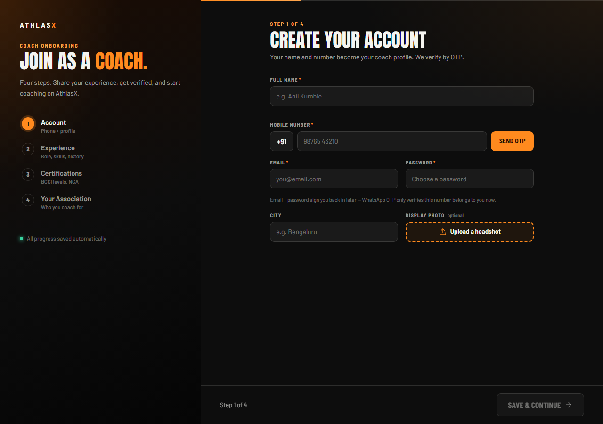
Full name, mobile number (+91, OTP-verified), email + password, city, and an optional headshot upload.

### 2. Step 1 — filled
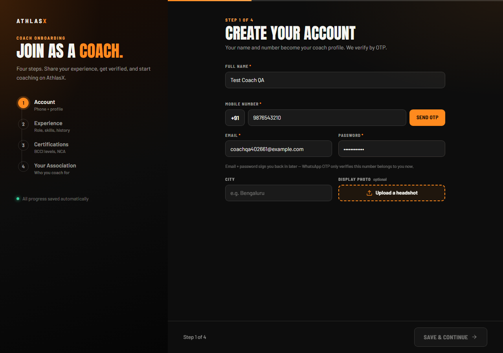
Filled with realistic test data (Test Coach QA, a test mobile number, generated email/password) immediately before requesting an OTP.

### 3. Step 1 — after "Send OTP"
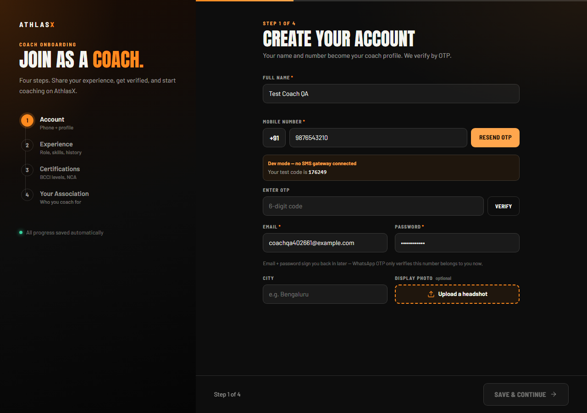
Dev-mode banner: "Dev mode — no SMS gateway connected," with the real generated code shown inline, a 6-digit OTP field, and a Verify button. The Send button relabels to "Resend OTP."

### 4. Step 1 — after Verify
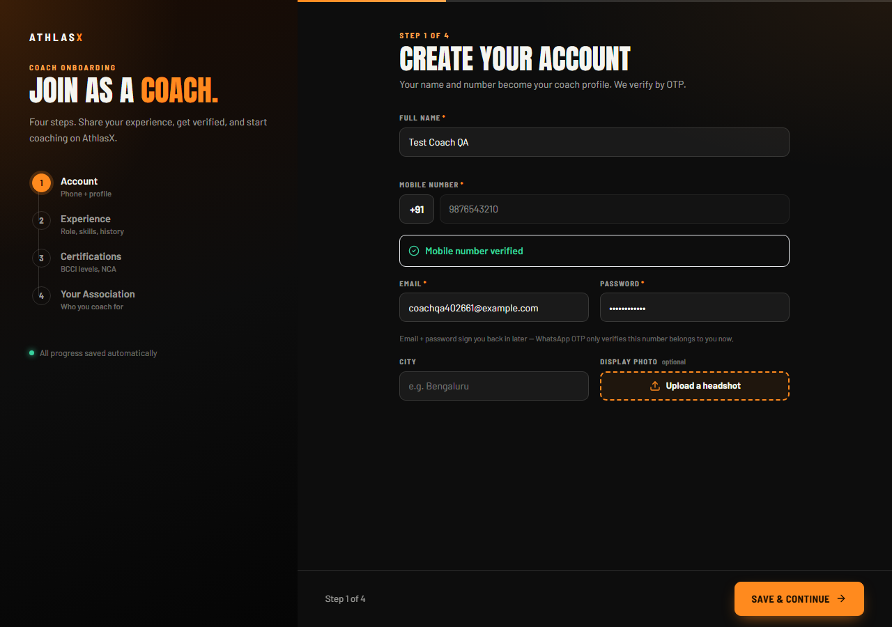
Mobile number field locks (disabled) and a "Mobile number verified" confirmation replaces the OTP entry block. Email, password, city, and headshot fields remain editable below.

### 5. Step 2 of 4 — Experience
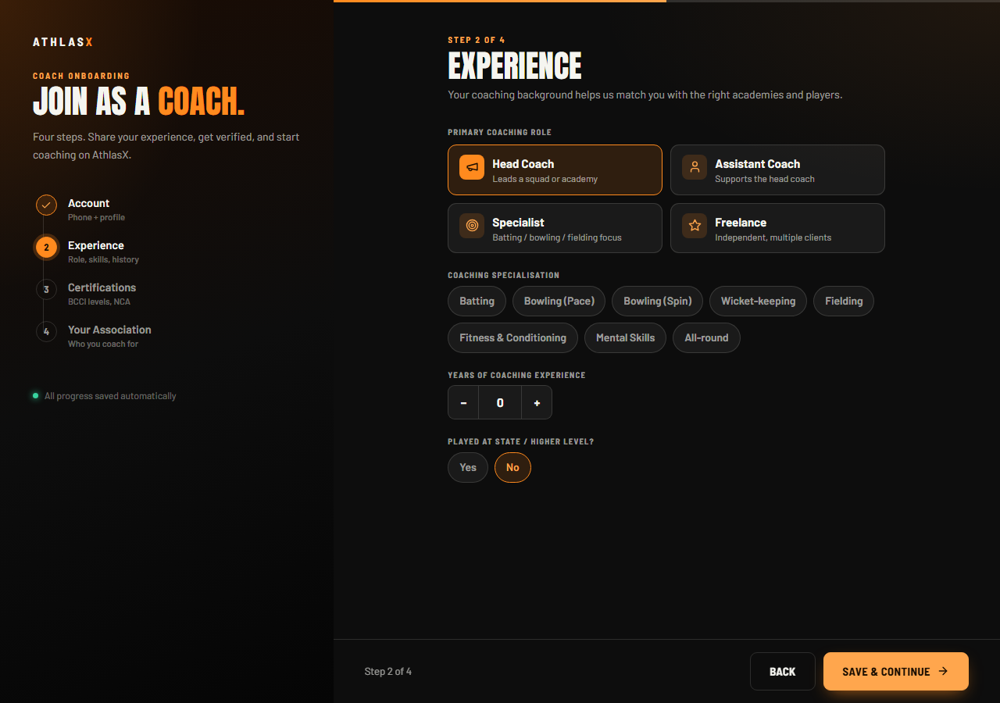
Primary coaching role (Head Coach / Assistant Coach / Specialist / Freelance), coaching specialisation tags (Batting, Bowling (Pace), Bowling (Spin), Wicket-keeping, Fielding, Fitness & Conditioning, Mental Skills, All-round), a stepper for years of coaching experience, and a Yes/No toggle for "Played at state / higher level?".

No unexpected states hit in the coach flow — OTP send/verify behaved as expected, and progressing to Step 2 didn't reset any prior input.

---

## Summary

| Role | Stages walked | Blocking issues | Notable state |
|---|---|---|---|
| Player | 3 of 3 (through consent review) | None | Losing Stage-2 progress on a premature Continue click is worth a UX call |
| Coach | 2 of 4 (through Experience) | None | — |
| Academy | Not attempted | `ACADEMY_SELF_SERVE_ENABLED = false` | Not a live signup path currently |
| Association | N/A | No wizard exists | Ops-mediated notice page only, out of scope |
