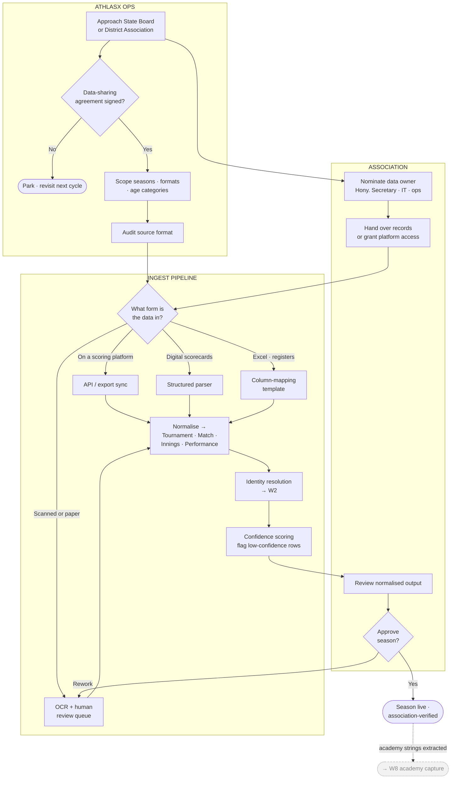
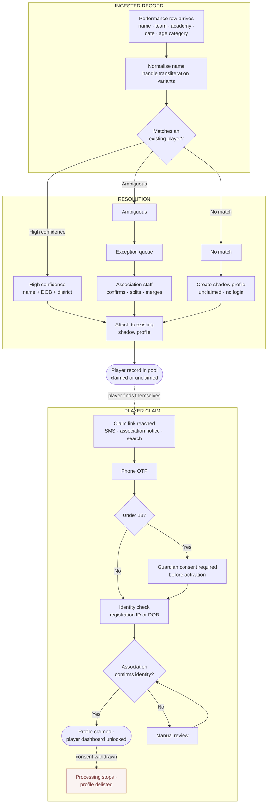
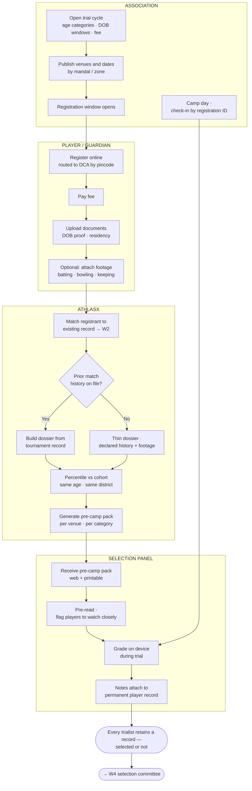
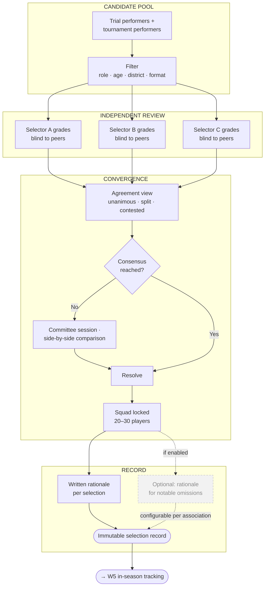
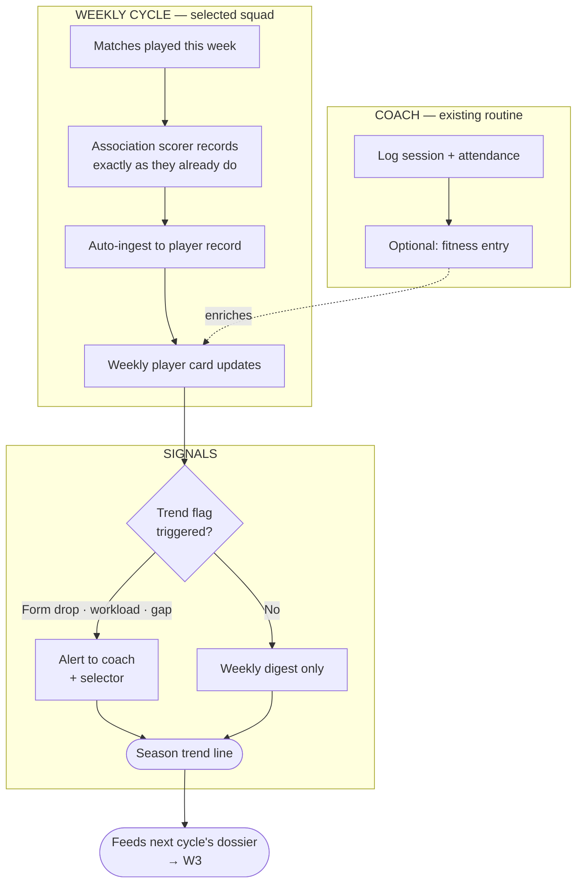
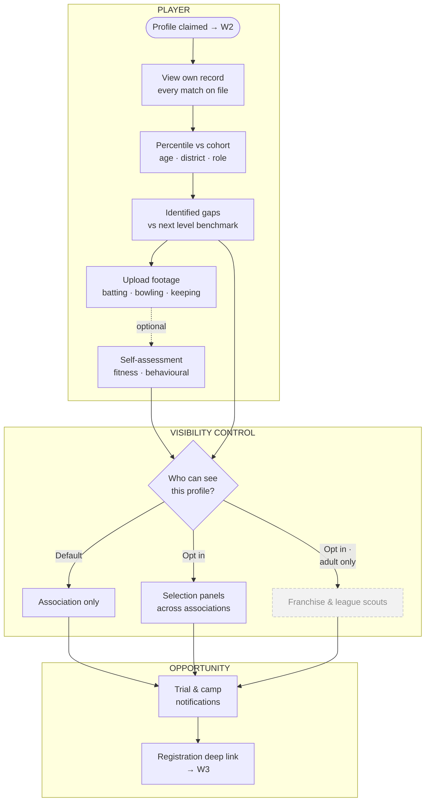
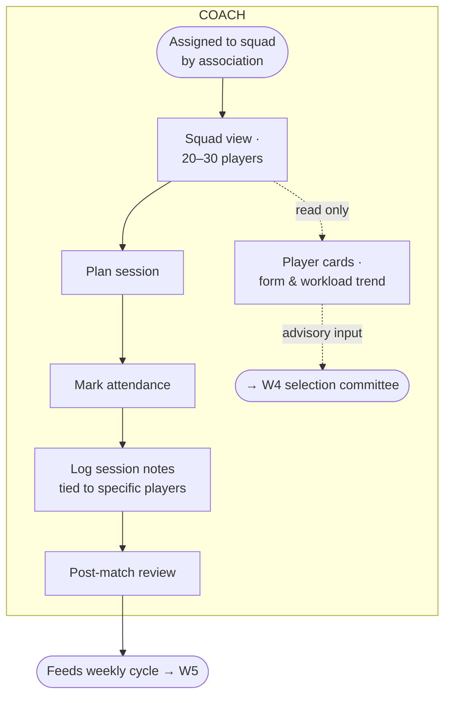
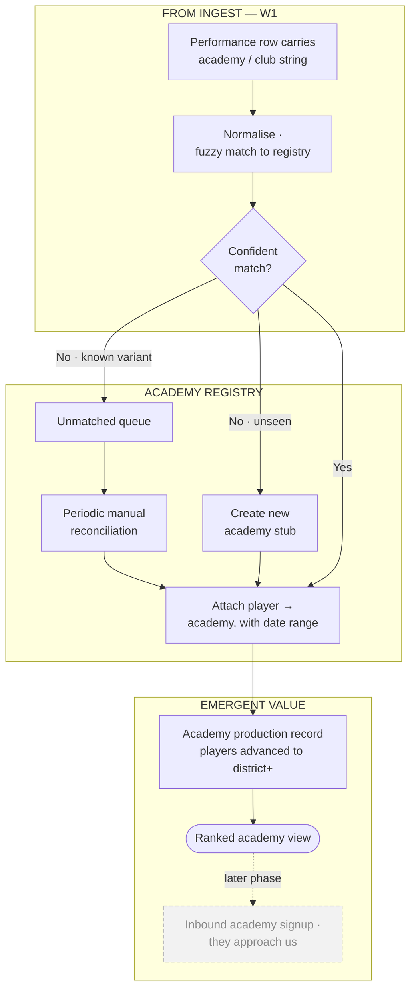
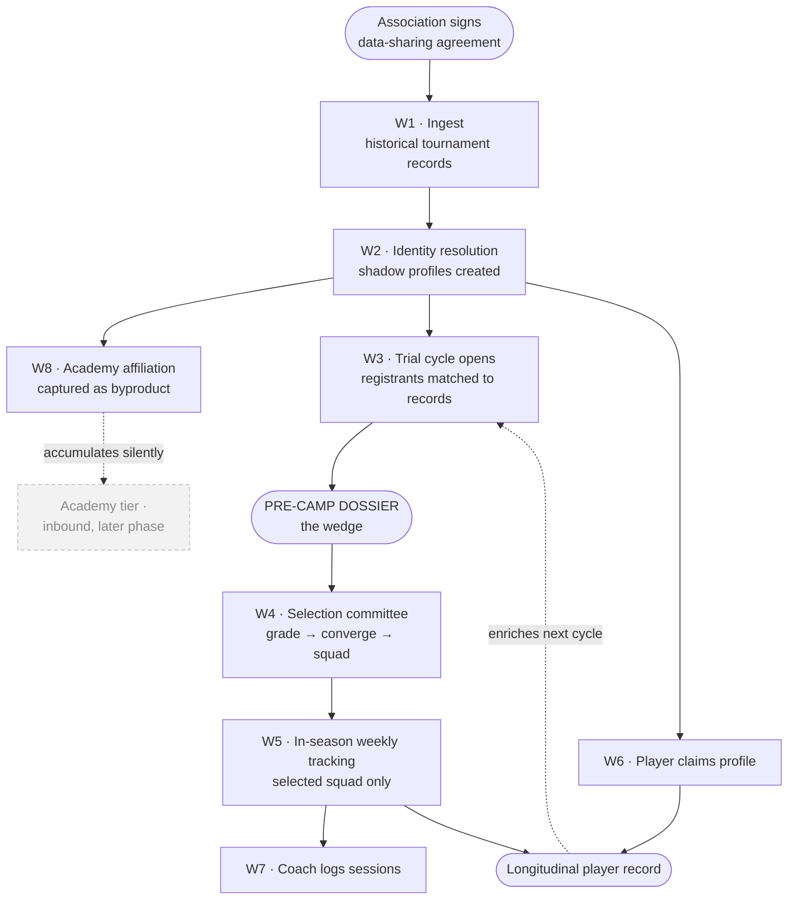

# AthlasX — Pathway Platform

**Market Position, Product Direction & Platform Workflows**

Version 1.0 · July 2026 · Internal — Confidential

> AthlasX is a talent-intelligence layer for the Indian cricket progression
> ladder: **Academy → District → State**. It is sold to the institutions that
> already run selection — District Cricket Associations and State Cricket
> Boards — and it is used by players, coaches and selection panels inside those
> institutions.
>
> This document establishes the market structure we are building against, the
> competitive position we occupy, the wedge we lead with, and the operational
> workflows of the web application.

---

## Contents

1. [Executive summary](#1-executive-summary)
2. [Market structure](#2-market-structure)
3. [Competitive landscape](#3-competitive-landscape)
4. [Strategic direction](#4-strategic-direction)
5. [Platform roles](#5-platform-roles)
6. [Workflows](#6-workflows)
7. [Core entities](#7-core-entities)
8. [Phasing](#8-phasing)
9. [Validation backlog](#9-validation-backlog)
10. [Sources](#10-sources)

---

## 1. Executive summary

Indian cricket's progression ladder is **institutionally governed, not scout-governed**.
A player moves from academy to district to state by performing in structured
tournaments and trials that are run, judged and recorded by District Cricket
Associations and State Cricket Boards. Independent scouts exist, but they operate
opportunistically on top of that ladder — they do not control entry to it.

This makes the buyer institutional. The associations already run the entire
selection apparatus: registration, trials, squad selection, tournaments. What they
do not have is **memory**. Every trial cycle evaluates thousands of players and
retains almost nothing about the ones not selected. Every tournament generates
performance data that is scored, published, and then functionally lost as an input
to the next selection decision.

**AthlasX sells memory and decision-support to the institution that already owns
the decision.**

The entry product is deliberately narrow: a **pre-camp dossier** — a one-page,
evidence-backed profile for every registered trialist, generated before a selection
camp from the association's own historical records. It is cheap for the association
(they already collect the registrations), immediately useful to the panel (they
currently walk in cold), and it creates the permanent player record that everything
else in the platform is built on.

Three constraints shape the plan and are treated as first-class throughout:

- **The scoring layer is already occupied.** CricHeroes partners with 23+ BCCI state
  associations for official scoring and ships white-labelled association apps. We do
  not compete for ball-by-ball capture. We consume it.
- **The selection layer is politically sensitive.** Making "who performed" legible
  against "who was picked" is valuable to a clean committee and threatening to a
  captured one. Audit features are configurable, never mandatory.
- **Two funded-looking startups and two institutional programmes are moving on
  adjacent ground.** Our defensibility is the association relationship and the
  longitudinal record, not the analytics.

---

## 2. Market structure

### 2.1 The progression ladder

The pathway from club cricket to state representation runs through a formal,
multi-stage funnel operated by the state association and its affiliated districts.
Uttar Pradesh is the reference implementation studied here:

| Stage | Operator | What happens |
|---|---|---|
| **Registration** | State association, routed to DCA by pincode | Online registration, fee payable, residency and DOB windows enforced |
| **District trials** | District Cricket Association | ~100–120 players selected per district, per age category |
| **Inter-district matches** | DCA / zone | Selected players grouped into teams, play 2–3 matches |
| **Inter-zonal** | State association | Top performers advance from across the state |
| **Final trials** | State association | Concentrated at a central venue (Kanpur, for UPCA) |
| **Final shortlist** | Selection committee | ~120 players statewide per category → **top 30** |
| **Squad** | Selection committee | Final team composition |

Key characteristics:

- **Registration is gated, paid and digital.** UPCA runs online registration at a
  dedicated portal with a ₹400 fee, one registration per mobile number, mandatory
  UP residency, and hard date-of-birth windows per age category (U14, U15 women,
  U16, U19, U23). The 2026–27 cycle opened 10 January 2026 with trials in March.
- **Registration is routed through the district by pincode.** The DCA is a
  structural gatekeeper, not an optional layer.
- **Coverage is incomplete.** Uttar Pradesh has 75 districts; approximately 40 have
  affiliated cricket associations. A third of the state has no formal district entry
  point at all.
- **The district tier runs its own competitive product.** Kanpur Cricket
  Association (founded 1951) operates a franchise-format city league alongside
  older league competitions, and the largest league in the state fields 83 teams
  across four groups. This is real, structured, recurring match data.

### 2.2 The evaluation bottleneck

The funnel above is severe, and the evaluation window per player is correspondingly
small. Delhi & District Cricket Association drew **over 3,500 registrations for its
phased open bowling trials alone**. UPCA compresses ~100–120 players per district
per category down to ~120 statewide, then to 30.

Two consequences follow, and they are the product opportunity:

1. **Selectors decide on very little evidence per player.** A panel evaluating
   hundreds of aspirants in a day cannot give any individual meaningful time. The
   decision is made on a first impression, in isolation, with no reference to what
   the player has done all season.
2. **The evidence is discarded.** A player who is not selected leaves no trace in
   the system. Next cycle, they arrive as a stranger again. The association pays for
   the evaluation and keeps none of the output.

> Field reporting indicates that unaffiliated players receive materially less
> evaluation time at open trials than players who already represent a district —
> on the order of a single over versus three to five. This is consistent with the
> funnel arithmetic above but is **not independently sourced**. See
> [§9 Validation backlog](#9-validation-backlog).

### 2.3 Where scouting actually happens

Independent scouting exists in Indian cricket but is **unsystematic, network-driven,
and invisible to the players being scouted**:

- **BCCI's Talent Resource Development Wing** was established in 2002 under Dilip
  Vengsarkar and deployed 20 (later up to 30) Talent Resource Development Officers
  to watch **local junior matches**, rate players on a uniform scale, and report to
  the National Junior Selection Committee and the NCA. TRDO Prakash Poddar
  identified MS Dhoni at a Jharkhand match in Jamshedpur in 2003. BCCI approved
  reviving the TRDO programme at a recent AGM.
- **IPL franchises scout down to district and local-league level.** Mumbai Indians
  and RCB scouts have been reported tracking the Jharkhand T20 League. Franchise
  scouting works through personal networks of coaches and ex-cricketers, with
  recommended video increasingly substituting for in-person viewing.
- **Coverage is acknowledged as fragmented.** Franchise scouts have publicly wished
  for a single accessible server of recorded domestic matches — the gap is
  systematic access, not interest.

The operative finding is therefore **not** that scouts are absent. It is that
**scouting is opportunistic and undiscoverable**, and that entry to the pathway is
nonetheless controlled by association selection committees rather than by scouts.
Both facts point to the same buyer.

### 2.4 The institutional map

The set of gatekeepers is small, known and finite:

- **38 BCCI full members**, holding voting rights. The 2025–26 Ranji Trophy was
  contested by 38 teams — at least one from each of 28 states and four union
  territories, plus institutional members Railways and Services.
- **One state does not always mean one association.** Gujarat and Maharashtra have
  three each. A top-down "convince the state, it mandates its districts" motion
  works in most states but not universally.
- Below each state association sit its affiliated District Cricket Associations —
  ~40 in Uttar Pradesh, organised into mandals.

Winning 3–5 state associations gives meaningful coverage and a credible reference
base. This is a narrow, enumerable sales motion.

### 2.5 Evidence confidence

Everything in this section carries an explicit confidence level. Nothing marked
*Reported* should appear in an external deck without further verification.

| Finding | Confidence | Basis |
|---|---|---|
| 38 BCCI full members / 38 Ranji teams | **Verified** | Public BCCI and competition records |
| UPCA registration is paid, gated, DCA-routed by pincode | **Verified** | UPCA registration portal and published guidance |
| UPCA funnel: ~120/district → ~120 state → top 30 | **Verified** | Published UPCA trial guidance |
| UP: 75 districts, ~40 with affiliated DCAs | **Verified** | UPCA affiliated-district listings |
| DDCA drew 3,500+ bowling trial registrants | **Verified** | Press report |
| TRDW/TRDO operates at local junior level; revived | **Verified** | BCCI programme history and AGM reporting |
| IPL franchise scouts work district/local leagues | **Verified** | Multiple press and long-form sources |
| Selection at district/state is committee-governed | **Verified** | UPCA process documentation |
| Selection data is politically contested | **Verified** | Documented corruption and selection-irregularity cases across multiple associations |
| Open trialists get ~1 over vs 3–5 for district players | **Unverified** |  |
| Associations will share historical records | **Untested** | No association conversation on record |
| Historical records exist in machine-readable form | **Untested** | Format unknown; see W1 |

---

## 3. Competitive landscape

### 3.1 CricHeroes — the incumbent data layer

CricHeroes is the operating system for grassroots cricket scoring in India: 40M+
users, 10M+ matches scored. Critically for us, it is **already inside the
institutions we are targeting**:

- Official scoring partnerships with **50+ ICC associations and 23+ BCCI state
  associations**, with a dedicated BCCI-affiliated-members directory.
- **White-labelled per-association applications shipped to production** — Baroda
  Cricket Association and Odisha Cricket Association both have branded apps built
  and published by CricHeroes. Assam has used the scoring app since mid-2019.
- Association-level presence in our own reference market: the Uttar Pradesh T20
  League has a CricHeroes association page, and Kanpur Cricket Association has a
  CricHeroes team profile with match history.

**Implication.** Two things follow, and they define our architecture:

1. **We do not build a scoring product.** Ball-by-ball capture is solved, free, and
   entrenched. Competing there is a losing fight for the same data.
2. **In many states our "historical records" ask resolves to a platform integration,
   not a digitisation project.** Before approaching any association, establish
   whether their data already sits in a structured third-party system. This is
   faster and better data than scanned scorebooks — but it means the relationship
   we need may be with the platform as much as the association.

CricHeroes' product DNA is community and capture, monetised through the tournament
ecosystem. Ours is institutional decision-support, monetised through the pathway.
That distinction is real today. It is not permanent, and we design assuming they
could move.

### 3.2 Direct competitors

Two India-focused startups occupy near-adjacent positions and should be tracked
continuously:

**ScoutEdge** (EdgeSphere Sports Intelligence Pvt Ltd)
- AI-driven talent scouting and video analysis, explicitly positioned as a
  *decision intelligence system for sports talent discovery*.
- Targets rural and tier-2/3 discovery; claims potential-rating accuracy and
  access to trials via IPL franchises, state associations and academies.
- Combines match performance with fitness data.
- **Overlap: high.** This is the closest public positioning to our thesis.

**QloSport**
- "AI-native cricket platform" with five defined roles: **Coach, Academy Owner,
  Player, Scout, Scorer.**
- Ships academy operations (attendance, fees, batches), a proprietary player
  rating, cross-academy scout search with rating filters, and ball-by-ball capture
  at sub-3-second-per-delivery with offline sync.
- Explicitly built around Indian academy operating reality — seasonal batches,
  cash fees, bilingual interface.
- **Overlap: high on the academy and player tiers; lower on the association tier.**

Adjacent, non-competing: **SportVot** occupies local-match live streaming and
production for organisers and associations — a potential content partner rather
than a rival.

### 3.3 Institutional programmes

Two well-resourced non-commercial actors are building overlapping datasets:

- **Khelo India / KIRTI** (Sports Authority of India). A unified national talent
  identification platform targeting ages 9–18, using AI-based prediction of sporting
  acumen, layered on the National Sports Talent Search Portal. A tender has been
  issued for portal development. This is government-funded competition for
  "national youth athlete database."
- **BCCI player registration.** BCCI operates an online database management system
  for player registration and issued a tender in 2025 for **player registration
  verification services**. Identity and age verification — frequently cited as a
  moat for private platforms — is being centralised by the board itself.

**Implication.** Do not position verification as the moat. Position it as a feature
we consume or mirror. The moat is the association workflow and the longitudinal
record.

### 3.4 Positioning

| Layer | Question answered | Owner |
|---|---|---|
| Capture | "What happened in this match?" | CricHeroes, association scorers |
| Broadcast | "Can I watch it?" | SportVot, local streams |
| Identity | "Is this player who they say they are?" | BCCI registration, association records |
| **Decision** | **"Who should this committee select, and why?"** | **AthlasX** |
| Development | "What should this player work on next?" | AthlasX, academy tools |

We are the decision layer. We are only defensible there if we are embedded in the
selection workflow itself, not sitting beside it as a reporting tool.

---

## 4. Strategic direction

### 4.1 The wedge — the pre-camp dossier

Lead with one artefact, not a platform.

**What it is.** For every player registered for an association trial or selection
camp, a single-page profile delivered to the selection panel *before* the camp:
identity and age-category confirmation, historical tournament record where one
exists, percentile position against the same age and district cohort, declared
strengths, and any player-uploaded footage.

**Why the association says yes.**
- **Near-zero operational cost.** They already run paid, structured registration.
  We consume what exists; we do not ask them to run new assessments.
- **Better-informed panels.** The panel currently walks in cold to evaluate
  hundreds of players in a day. The dossier converts a single over from a cold
  first impression into confirmation of a known profile.
- **Permanent record.** Every player evaluated is retained, selected or not.
  The association stops discarding the output of its own process.

**Why it is the right wedge commercially.** It is small enough to build against a
fixed calendar deadline (trial cycles are annual and published), it justifies the
historical-data ask without appearing to audit anyone, and it produces the player
record on which the rest of the platform depends.

### 4.2 Sequencing

```
Pre-camp dossier  →  Permanent trialist record  →  Historical tournament ingest
      →  Selection committee workflow  →  In-season weekly tracking
      →  Academy tier (inbound)
```

Each stage is justified by the previous one and requires no new commitment from the
association beyond what the previous stage already established.

### 4.3 Academy data as a byproduct

Tournament and trial records carry the **academy each player represents**. Ingesting
association data therefore produces academy-affiliated player records as a
byproduct, at no additional acquisition cost.

This collapses the "serve associations" and "serve academies" strategies into a
single sequence rather than a fork. By the time we open an academy-facing product,
we already hold historical records for the academies whose players reach district
level — and those academies have a reason to come to us rather than be sold to.

### 4.4 Non-goals

Explicit, so scope stays honest:

- **We do not build ball-by-ball scoring.** Solved and entrenched.
- **We do not build live streaming.** Partner if needed.
- **We do not sell to individual academies in phase 1.** No scout-side buyer exists
  at that tier to subsidise it, and the sales motion is thousands-wide.
- **We do not build an independent-scout marketplace in phase 1.** Scouts do not
  control pathway entry; associations do.
- **We do not make selection audit mandatory.** It is a configurable capability.
  Forcing it will lose associations we need.

---

## 5. Platform roles

| Role | Who they are | Primary job on the platform |
|---|---|---|
| **Player / Guardian** | Registered aspirant, academy or district player. Frequently a minor | Claim and own a profile; add footage; track own development |
| **Selection Panel** | Association selectors, sitting as a committee | Review dossiers pre-camp; grade at camp; converge on a squad |
| **Coach** | District or state squad coach | Run the squad; log sessions and attendance; feed the record |
| **Association** | DCA or State Board staff — Hony. Secretary, IT, operations | Onboard data; run trial cycles; approve identity resolution; govern access |
| **AthlasX Ops** | Internal | Onboard associations; run ingest; resolve exceptions |
| **Scorer** *(external)* | Association scorer, existing role | Unchanged. Their existing output is our input |

> **Design principle.** The selector is a **committee member, not an individual
> scout.** The workflow must support multiple independent graders, a convergence
> view, a meeting, and a recorded rationale — not a lone user running searches and
> building a private watchlist.

### Role × phase matrix

Every player record moves left→right through six phases. A cell is **active** (the
role acts) or *passive* (the role waits or is acted upon). The output rail names
the artefact each phase emits.

| Role ▽ / Phase ▷ | **1 · Ingest** | **2 · Identity** | **3 · Enrich** | **4 · Evaluate** | **5 · Decide** | **6 · Track** |
|---|---|---|---|---|---|---|
| **Association** | Hand over records / grant access | Confirm ambiguous merges | Open trial cycle | Run camp, check-in | Publish squad | Govern access |
| **Player** | *passive* | Claim profile via OTP + consent | Upload footage, declare history | Attend trial | *passive* | View own trend line |
| **Selection Panel** | *passive* | *passive* | *passive* | Pre-read dossiers; grade at camp | Independent grade → converge → squad + rationale | Receive form alerts |
| **Coach** | *passive* | *passive* | *passive* | *passive* | Advisory input | Log sessions, attendance, notes |
| **AthlasX Ops** | Run pipeline by source format | Resolve exception queue | *passive* | Generate pre-camp packs | *passive* | Monitor trend flags |
| **Output rail** | Normalised match & performance rows | Resolved player entities | Enriched profile | **Pre-camp dossier** | Squad + immutable selection record | Weekly player card |

---

## 6. Workflows

Legend used throughout:

- `[ ]` step · `{ }` decision · `([ ])` terminal or output artefact
- solid arrow = required path · **dotted arrow** = optional or parallel
- **dashed grey node** = parked / later phase · **red node** = stop or withdrawal state

---

### W1 · Association onboarding & historical ingest

The gating workflow. Everything downstream depends on it, and its cost is set
entirely by one variable: **what form the association's records are already in.**



**Notes**
- The `P0` decision is the single biggest cost driver in the business. Determine it
  in the *first* conversation with any association, not after signing.
- If the answer is "already on a scoring platform," the integration is cheap and the
  data quality is high — but confirm who controls export rights.
- Association approval at `S4` is what converts ingested rows into
  *association-verified* records. That verification status is the trust primitive
  the whole platform trades on.

---

### W2 · Player identity resolution & claim

Ingested performance rows refer to people who mostly do not have accounts. The
platform must create and maintain **shadow profiles** that exist before any player
signs up, then let the real person claim one.



**Notes**
- **A large share of these players are minors.** Guardian consent is a hard gate
  before activation, and withdrawal must be honoured at any point. This is not an
  afterthought — it is a precondition of operating at U14/U16 level at all.
- Unclaimed shadow profiles are visible to the association that supplied the data,
  and not publicly discoverable until claimed and consented.
- The exception queue is deliberately routed to **association staff**, not AthlasX.
  They know their players; they are the authority on identity; and it keeps our
  operating cost near zero.

---

### W3 · Trial cycle → pre-camp dossier *(core loop)*

The wedge product. This is the workflow that must work perfectly before anything
else ships.



**Notes**
- The dossier degrades gracefully. A player with no history still gets a page —
  identity, age confirmation, declared record, footage. A thin dossier is still
  better than nothing, and it is the hook that makes the player claim their profile.
- `REC` is the association-facing value proposition in one node: **the association
  stops discarding the output of its own evaluation process.**
- Grading at `V3` must work offline. Trial grounds do not have reliable
  connectivity, and a panel will not wait for a spinner.

---

### W4 · Selection committee

Selection is a **committee act**, and the workflow must reflect that. Independent
grading first, convergence second, meeting third, recorded outcome last.



**Notes**
- **Blind independent grading before convergence** is the single most valuable
  design choice here. It surfaces genuine disagreement instead of letting the
  loudest voice anchor the room, and it is a feature a clean committee will
  actively want.
- **`G8` is deliberately optional and off by default.** Recording rationale for
  players *not* selected is the highest-value audit feature and the highest-risk
  sales objection. Make it a switch the association controls. Never ship it on.
- The immutable record at `G7` is what makes next cycle's dossier richer. Selection
  history compounds.

---

### W5 · In-season weekly tracking

Applies to the selected squad only — 20–30 players. **The design constraint is that
this must create no new labour for anyone.**



**Notes**
- `W2` is the load-bearing assumption: the scorer's existing output is our input.
  If weekly tracking requires anyone to do new data entry, it will not survive
  contact with a real season. Verify per association before promising it.
- Coach input (`W4`, `W5`) is **optional enrichment**, not a dependency. The cycle
  completes without it.

---

### W6 · Player development loop

The player-side product. Free, and the reason players claim profiles — which is
what makes the dataset real rather than administrative.



**Notes**
- **Default visibility is association-only.** Broader exposure is opt-in, and
  scout-tier exposure is adult-only. Given the age profile of this population, this
  is both the right default and a defensible one.
- `M4` is parked for phase 1 — the franchise-scout tier is the eventual revenue
  line, not the launch surface.

---

### W7 · Coach

District and state squad coaches. Deliberately thin in phase 1: the coach is a
contributor to the record, not the primary customer.



**Notes**
- The coach **advises** selection; they do not decide it. Reflect that in
  permissions: read access to the pool, write access to their own squad's notes,
  advisory-only input into `W4`.
- Everything here already exists conceptually in academy tooling. Do not over-invest
  in phase 1 — this tier is where the market is most crowded.

---

### W8 · Academy affiliation capture

Runs silently off W1. No academy signs up, no academy is sold to, and the academy
dataset accumulates anyway.



**Notes**
- Academy names arrive as free text and will be messy — abbreviations, Hindi/English
  variants, branch suffixes. Budget for reconciliation; do not assume clean joins.
- `Y9` is a genuinely novel asset: **which academies actually produce district-level
  players**, evidenced rather than claimed. Nobody currently holds this. It is the
  reason academies will eventually come inbound.

---

### W9 · Master flow

How the workflows compose. This is the system in one view.



The loop `Z5 → Z6 → Z7 → Z8 → Z10 → Z5` is the compounding engine. Each cycle makes
the next cycle's dossiers better, which makes the association more dependent, which
makes the data richer. Everything else is scaffolding around that loop.

---

## 7. Core entities

Conceptual model. Naming is indicative, not final.

| Entity | Key fields | Notes |
|---|---|---|
| **Association** | type (state / district), parent, state, affiliated districts | State ⇄ district is a hierarchy, not a flat list |
| **Player** | canonical identity, DOB, district, claim status, consent status | **Exists independently of any user account.** Shadow profiles are the default state, not an edge case |
| **User** | login, role, linked player or staff record | Optional. Most players in the system will never have one |
| **Academy** | name, canonical + variants, district, verification | Populated from free-text ingest; needs a variant table |
| **Tournament** | association, season, format, age category, level | Level drives match-quality weighting |
| **Match** | tournament, date, teams, venue, source, confidence | Source and confidence travel with every row |
| **Performance** | match, player, batting / bowling / fielding lines | The atomic unit. Everything aggregates from here |
| **TrialCycle** | association, age category, DOB window, venues, dates | Mirrors the association's real cycle |
| **Registration** | trial cycle, player, fee status, documents | The bridge between an aspirant and a record |
| **Dossier** | registration, generated_at, contents snapshot | Immutable once issued to a panel |
| **Grade** | selector, player, trial cycle, scores, notes | Blind until convergence |
| **Selection** | trial cycle, squad, rationale, decided_at | Immutable |
| **PlayerWeek** | player, week, aggregated performance, flags | Drives W5 |

Two structural requirements worth stating explicitly, because they are easy to get
wrong and expensive to retrofit:

1. **Player must be decoupled from User.** Bulk ingest creates thousands of players
   who have never logged in. Any model where performance data hangs off an account
   cannot ingest association data.
2. **Provenance travels with every row.** Source, ingest method, confidence, and
   association-approval status must be queryable per performance. Trust is the
   product; it has to be represented in the data, not asserted in marketing.

---

## 8. Phasing

| Phase | Scope | Exit criterion |
|---|---|---|
| **0 · Prove the data** | One association, one tournament's historical records, ingested end to end | We know the true `P0` cost. Format audit complete |
| **1 · Wedge** | W1 + W2 + W3. One trial cycle, one age category, one association | A panel used dossiers at a real camp and would use them again |
| **2 · Decision** | W4. Committee grading and selection record | One squad selected through the platform |
| **3 · Retention** | W5 + W6 + W7. Weekly tracking of the selected squad; player claim at scale | A full season tracked with no new labour on the association |
| **4 · Expand** | Second and third association. W8 surfaces academy production data | Reference-able pilot; inbound academy interest |

Phase 0 is not a formality. Until one folder of real association records has been
ingested end to end, the central economic assumption of this business is untested.

---

## 9. Validation backlog

Open questions, ordered by how much they would change the plan.

1. **Is our target association already on a third-party scoring platform?**
   Decisive. If yes, the data ask is an integration conversation and possibly a
   partnership conversation, not a digitisation project. *Blocks: W1 scoping.*
2. **What form are the historical records actually in?** Get one tournament's raw
   records from one district association. Everything in §8 Phase 0. *Blocks:
   costing the entire business.*
3. **Confirm the trial evaluation-time asymmetry.** The claim that unaffiliated
   trialists get roughly one over against three to five for district players rests
   on a single player interview. Verify with two more district players from
   different districts and one DCA secretary. *Blocks: using it in any pitch.*
4. **Will an association actually share?** No association conversation is yet on
   record. Every institutional assumption in this document is currently untested
   against a real buyer. *Blocks: everything.*
5. **Who pays, and when?** Working assumption: the association pilot is free in
   exchange for data, and revenue comes later from state-league and franchise
   scout access to the district tier. Decide deliberately rather than by drift.
6. **Does the audit capability help or hurt the sale?** `W4/G8` is our highest-value
   and highest-risk feature. Test the reaction before building it.
7. **Consent and minors at scale.** A large share of this population is under 18.
   Establish the guardian-consent and data-retention position properly before
   ingesting a single record, not after.

---

## 10. Sources

Institutional structure and pathway
- [Ranji Trophy](https://en.wikipedia.org/wiki/Ranji_Trophy) · [BCCI member associations](https://en.wikipedia.org/wiki/List_of_members_of_the_Board_of_Control_for_Cricket_in_India)
- [UPCA trials registration portal](https://registration.upca.tv/login) · [UPCA affiliated districts](https://www.upca.org.in/district.html) · [UPCA trials process guide](https://www.gocricit.com/post/cracking-the-upca-trials-your-guide-to-mastering-cricket-in-uttar-pradesh)
- [Kanpur Cricket Association](https://kanpurcricketassociation.com/) · [Kanpur Premier League](https://www.sportskeeda.com/cricket/kanpur-premier-league-2025-full-schedule-squads-match-timings-live-streaming-details)
- [DDCA open bowling trials — 3,500+ registrants](http://www.uniindia.com/~/ddca-bowling-trials-attract-over-3-500-aspirants-across-delhi/Sports/news/3756391.html)

Scouting
- [Talent Resource Development Wing](https://en.wikipedia.org/wiki/Talent_Resource_Development_Wing) · [TRDO programme revival](https://cricketaddictor.com/cricket-news/indian-cricket-in-crisis-ms-dhonis-identification-program-restarted-rp-singh-pragyan-ojha-appointed-selectors-234868/)
- [The scouts — The Cricket Monthly](https://www.thecricketmonthly.com/story/888105/the-scouts) · [IPL scouting process — Sharda Ugra](https://www.olympics.com/en/news/sharda-ugra-ipl-scouting-process-talent-identification) · [MI and RCB scouts, Jharkhand T20](https://www.newkerala.com/news/a/ipl-scouts-from-mi-rcb-arrive-ranchi-track-807.htm)

Competitive
- [CricHeroes — BCCI affiliated associations](https://cricheroes.com/state-cricket-associations-bcci) · [Baroda CA app](https://play.google.com/store/apps/details?id=com.cricheroes.bca&hl=en_IN) · [Odisha CA app](https://play.google.com/store/apps/details?id=com.cricheroes.oca&hl=en_IN) · [UP T20 League on CricHeroes](https://cricheroes.com/association/1383/uttar-pradesh-t20-league-/home)
- [ScoutEdge](https://scoutedge.in/) · [ScoutEdge profile — Analytics India Magazine](https://analyticsindiamag.com/ai-startups/how-ai-driven-sports-tech-startup-scoutedge-is-democratising-athlete-scouting-in-india/) · [QloSport](https://www.qlosport.com/) · [SportVot](https://sportvot.com/about-us)

Institutional programmes
- [Khelo India KIRTI](https://www.iasgyan.in/daily-current-affairs/khelo-india-rising-talent-identification-kirti-program) · [KIRTI portal tender — SAI](https://sportsauthorityofindia.gov.in/sai/assets/news/1734078812_Tendernotice_1-4.pdf)
- [BCCI player registration verification tender](https://www.bcci.tv/articles/2025/news/55556241/board-of-control-for-cricket-in-india-bcci-invites-proposals-for-provision-of-verification-services-for-player-registration)

Governance risk
- [The rot in Haryana's district cricket associations — The Caravan](https://caravanmagazine.in/extract/neeraj-kumar-cop-in-cricket) · [HCA U-19 selection charges](https://www.deccanchronicle.com/southern-states/telangana/hca-faces-charges-in-u-19-team-selection-1910246)
