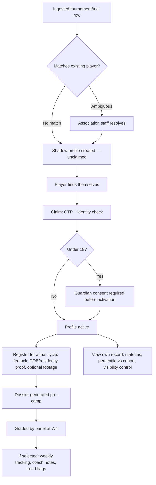
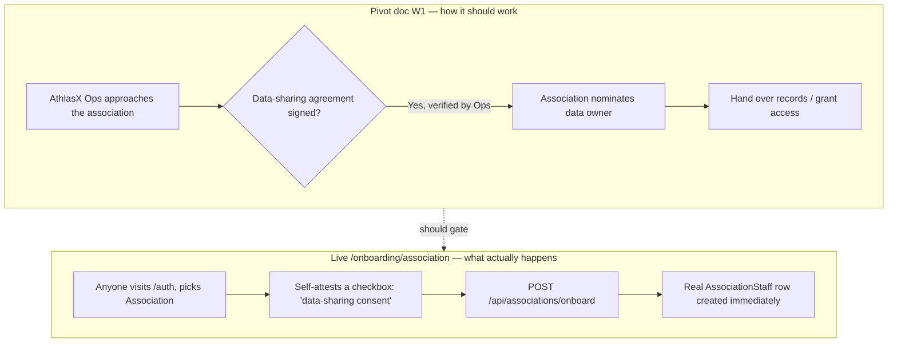
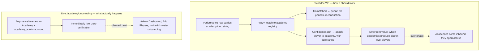
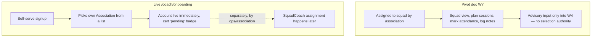

# AthlasX — Pivot Document Compliance Audit & Role-Based Prompts

_Audited against `Pivot_Document_Finalized.pdf` v1.0 (July 2026) and the live repo (`git log`, `grep`, Prisma schema) on 2026-09-06. Confidence tags: [Certain] = read directly off the doc and the code, [Likely] = strong inference, [Guessing] = filling a gap neither answers._

## 0. Two findings that matter more than any styling question

[Certain] **Self-serve academy onboarding directly contradicts a written non-goal.** §4.4 of the pivot doc states, in these words: "We do not sell to individual academies in phase 1. No scout-side buyer exists at that tier to subsidise it, and the sales motion is thousands-wide." The live `/academy/onboarding` page and its `POST /api/academy/onboard` route do exactly that — anyone with a phone number can self-verify an OTP they requested themselves and get a live `Academy` row plus an `academy_admin` account, with zero association or Ops involvement. There's no `academy_admin` role anywhere in the pivot document's own Platform Roles table (§5) either — it lists exactly six roles (Player/Guardian, Selection Panel, Coach, Association, AthlasX Ops, Scorer), and academy administration isn't one of them. This isn't a styling gap or a missing page — it's a shipped feature the strategy document explicitly says shouldn't exist yet.

[Certain] **Self-serve association onboarding inverts the entire W1 trust model.** The pivot doc's W1 workflow starts with *AthlasX Ops* approaching a state board or district association and confirming a signed data-sharing agreement — that agreement, verified by a person on your side, is what the whole platform's trust chain rests on ("Association approval... is what converts ingested rows into association-verified records. That verification status is the trust primitive the whole platform trades on.") The live `/onboarding/association` page replaces that with a checkbox on the sign-up form itself: `dataSharingSigned: body.dataSharingSigned === true` — the association attests to itself, and `POST /api/associations/onboard` immediately grants a real `AssociationStaff` row with real scoped write access (trial cycles, identity-exception resolution, everything gated by `association-scope.ts`). Anyone can type "Kanpur Cricket Association" into that form today and get staff-level access to a real association record. This is a governance/security gap, not a scope question — it needs a decision, not a restyle.

Both are addressed with decision-gated prompts in §5, not silently fixed — the same pattern used throughout this engagement for calls that aren't mine to make.

## 1. What the audit actually confirms was built faithfully

Worth saying plainly, since §0 is all bad news: the backend workflows this document was clearly written to spec (W1 ingest, W2 identity/claim, W3 trial→dossier, W4 selection, W5 weekly tracking) were built with real fidelity to it, not approximated. Directly verified:

- Every entity in §7's Core Entities table exists in `prisma/schema.prisma` under close to the same name: `TrialCycle`, `Registration`, `Dossier`, `Grade`, `Selection`, `OmissionRationale`, `PlayerWeek`, `IdentityException`.
- `PlayerWeek.fitness_rating`/`behaviour_rating` carry the comment "coach-supervised only — never self-reported," matching the pivot doc's repeated insistence on this exact rule.
- `PlayerWeek.coach_note` is capped at 200 chars "enforced at the API boundary," matching W5's spec precisely.
- `VisibilityTier` is exactly `association_only | cross_association | franchise_scout` — the same three tiers, same "franchise_scout is parked for phase 1" framing as W6's notes.
- `IdentityException` carries `reason`/`candidate_player_ids`/`performance_snapshot`, matching W2's ambiguous/high-confidence/no-match resolution routed to association staff, not AthlasX ops.
- `/trial-cycles/[id]/register` genuinely implements W3's "pay fee, upload DOB proof, upload residency proof, optional footage" — and does it honestly: "Pay ₹{fee} in cash at the venue — online payment isn't available yet," rather than faking a payment flow. This is the right call, not a shortcut.

The gaps in this core loop are small and already known, not new: `/api/my-record` has no percentile field (W6 explicitly calls for "Percentile vs cohort — age, district, role"), and `/selection`'s candidate rows are visually clickable but wired to nothing (both flagged previously in `docs/AthlasX_Design_Consistency_and_Page_Flow_Map.md`).

## 2. Workflow-by-workflow compliance table

| Workflow | Spec | Built? | Notes |
|---|---|---|---|
| W1 · Association onboarding & ingest | Ops-mediated, gated on a verified data-sharing agreement | **Partially — inverted.** Ingest pipeline (format detection, OCR queue, identity resolution, confidence scoring) matches the spec. The onboarding *front door* doesn't — see §0. | Decision needed |
| W2 · Player identity resolution & claim | Shadow profiles, exception queue to association staff, OTP claim, guardian consent for minors | **Built, matches spec.** `IdentityException`, `PlayerClaim`, guardian-consent gating all present. | — |
| W3 · Trial cycle → pre-camp dossier | Registration → dossier generation → panel pre-read → grading | **Built, matches spec.** `TrialCycle`/`Registration`/`Dossier`/`Venue` all present; register flow is honest about what it does and doesn't collect. | — |
| W4 · Selection committee | Independent blind grading → convergence → immutable record, rationale optional/off by default | **Built, matches spec** per the earlier System Design doc (blind grading is "the thing that must never regress" — already a first-class concern in the codebase). | — |
| W5 · In-season weekly tracking | Selected squad only, coach input optional, trend flags, no new labour | **Built, mostly matches spec.** `PlayerWeek`/`TrendAlert` schema is faithful. Cohort percentile on the player's own view is still missing (`§1` above). | Small gap, already tracked |
| W6 · Player development loop | View record, percentile vs cohort, footage, self-assessment, visibility control | **Mostly built.** Visibility tiers match exactly. Percentile missing. | Small gap |
| W7 · Coach | Assigned to squad *by the association* — advisory input only, no selection authority | **Built, but provisioning is inverted.** The live coach onboarding is self-serve with a free choice of association, not association-initiated assignment. Squad membership itself is still association/ops-controlled (`SquadCoach` rows), so the blast radius is smaller than W1/academy, but the account-creation direction doesn't match the doc. | Lower-severity decision |
| W8 · Academy affiliation capture | Silent byproduct of ingest — "no academy signs up, no academy is sold to" | **Violated.** A full self-serve academy signup product exists (`/academy/onboarding`, `academy_admin` role), plus a queued Admin Dashboard/Add Players/Self-Registration build — none of which W8 describes. W8's actual silent fuzzy-match-to-registry design (§ "Academy affiliation capture") has no implementation at all — nothing in the ingest pipeline attempts academy-string normalization into an `Academy` registry as a byproduct. | Decision needed |
| W9 · Master flow | Composition of the above | Composition is correct where W1-W7 are correct; broken the same way W1/W8 are broken. | — |

## 3. Corrected flow per role, as the pivot document actually specifies it

### Player — matches the built app closely



This is already close to what's built (`/claim`, `/player/onboarding` self-registration as an alternate entry when no shadow profile exists yet, `/trial-cycles/[id]/register`, `/record`). The one structural gap is the missing percentile (§5 P-1).

### Association — spec vs. built



### Academy — spec vs. built



### Coach — spec vs. built, smaller gap



## 4. Prompts, grouped by role

### Player

**Prompt P-1 — close the missing percentile gap (W5/W6)**

```
Add cohort percentile to the player's own record view, per the pivot
document's W6 spec ("Percentile vs cohort — age, district, role"). This
gap was already flagged in docs/AthlasX_Design_Consistency_and_Page_Flow_Map.md
§0 and is confirmed still open (grep for "percentile" in
src/app/api/my-record/route.ts returns nothing).

Compute the player's percentile rank on their AthlasX Score against other
PlayerProfile rows sharing the same age category, district, and playing
role, and return it from GET /api/my-record. Surface it on
src/app/(dashboard)/record/page.tsx near the existing score display.

Do not change the score computation itself, the visibility-tier gating,
or any other field in the response. Verify with npx tsc --noEmit,
npm run lint, npm test, and a manual check that the percentile is
believable (spot-check against a manual count in a test fixture).
```

Player-facing design consistency (restyling `/player/onboarding`, `/record`, `/claim`, `/profile`) is already covered by Prompts 1 and 10 in `docs/AthlasX_Page_Inventory_and_Design_Rollout_Prompts.md` — not repeated here.

### Association

**Decision made: path (a), Ops-only creation.** Reasoning: the pivot document's own market section (§2.4) describes this as "a narrow, enumerable sales motion" — 3-5 state associations, each a real institutional relationship an Ops person is personally involved in, not a self-service funnel with unknown signups to vet at volume. Path (b)'s `verification_status` field would also require a schema change (`prisma db push`, still held pending separate authorization) to gate a form that shouldn't be publicly reachable in the first place. Path (a) needs no schema change at all.

**Prompt A-1 — remove public self-serve association signup, replace with an internal Ops-only tool**

```
Remove the public path to creating an Association. Specifically:

1. src/app/onboarding/association/page.tsx and
   src/app/api/associations/onboard/route.ts: remove both, or gate them
   behind a feature flag defaulting to off (same pattern as
   FRANCHISE_SCOUT_ENABLED in src/lib/feature-flags.ts) if you'd rather
   keep the code reachable for reference than delete it outright. Either
   way, nobody outside an authenticated athlasx_ops session should be
   able to reach this path going forward.

2. src/app/auth/page.tsx: remove the "Association" card from the sign-up
   role picker (ROLES array), the same way "Scout" already renders as
   unavailable rather than routing anywhere. Sign-IN for existing
   association staff is unaffected — this only removes the sign-UP path.
   State plainly whether you're removing the card entirely or disabling
   it with explanatory copy like Scout's.

3. Build a new internal-only page, e.g.
   src/app/(dashboard)/ops/associations/new/page.tsx, reachable only to
   sessions with role athlasx_ops (check this the same way every other
   route checks role — via require-auth.ts, not a client-side guard).
   This page collects the same fields the removed self-serve form did
   (association name, type, state, parent association if district, first
   staff member's email + password) plus one new explicit field:
   confirmation that Ops has personally verified a signed data-sharing
   agreement (a checkbox is fine here, since the person checking it IS
   the verifier, not the association attesting to itself — that's the
   actual distinction this whole fix is about). Reuse
   POST /api/associations/onboard's underlying logic (transaction
   creating Association + AssociationStaff + minted session are no
   longer needed for the ops case — the ops user doesn't need a session
   swap, they need the new staff member to receive their own
   credentials, e.g. via a generated temporary password or an invite
   email if one exists in this codebase; check before inventing a new
   notification mechanism).

4. Add this new route to NAV_SECTIONS or wherever athlasx_ops-visible
   navigation lives, gated to that role only.

Do not change association-scope.ts, the AssociationStaff model, or
anything about how existing associations authenticate — this only closes
the public creation path.

Separately, flag for manual review (do not act on this yourself): query
the Association table for any rows not present in prisma/seed.ts — those
would be self-serve signups created since commit 812e6f7 shipped, and
whoever created them has real AssociationStaff access today. List them in
your summary; a human needs to decide whether each is legitimate.

Verify with npx tsc --noEmit, npm run lint, npm test, and a manual check
that /onboarding/association and POST /api/associations/onboard both
correctly refuse access (404 or a clear "not available" state, not a
silent form that still submits).
```

Design-consistency restyling for `/onboarding/association` (Prompt 3 in `docs/AthlasX_Page_Inventory_and_Design_Rollout_Prompts.md`) is superseded by this decision — that page is being removed, not restyled. Skip Prompt 3 in the other document; the new internal ops tool from A-1 above should still get the shared Button/Card/token treatment from Prompt 0 once it exists, for the same "every page consistent" reason as everything else, just as a lower-priority internal tool rather than a public-facing page.

### Academy

**Decision made: path (b), flag off by default.** Reasoning: nothing built here is a fully-shipped console yet — only `/academy/onboarding` and the underlying schema exist; the Admin Dashboard, Add Players, and Player Self-Registration screens are still in Prompt 6's decision-gated queue, unbuilt. The pivot doc's exclusion is reasoned, not a hedge ("no scout-side buyer exists at that tier to subsidise it, and the sales motion is thousands-wide"), and the self-serve academy path most likely exists because the design-import work implemented mockups literally, page by page — the same way the Association self-serve flow did — not because of a considered decision to enter the academy market. Ratifying it into the strategy document would misrepresent its own provenance. Flagging it off costs nothing already built and is cheap to reverse if a real academy go-to-market decision gets made later — the `FRANCHISE_SCOUT_ENABLED` pattern already exists in this codebase for exactly this situation.

**Prompt AC-1 — gate the self-serve academy signup path behind a feature flag, default off**

```
Add an ACADEMY_SELFSERVE_ENABLED flag to src/lib/feature-flags.ts,
following the exact same pattern as the existing FRANCHISE_SCOUT_ENABLED
(hardcoded false, same file, same style of comment explaining why).

Gate on it:
1. src/app/academy/onboarding/page.tsx — when the flag is off, render the
   same "not available yet" treatment src/app/auth/page.tsx already uses
   for the disabled Scout role card, rather than 404ing outright (this
   mirrors an existing pattern in this codebase, don't invent a new one).
2. src/app/api/academy/onboard/route.ts — return a 403 with a clear
   message when the flag is off, checked at the top of the handler before
   any DB writes.
3. src/app/auth/page.tsx — the "Academy" card in the sign-up role picker
   (ROLES array) should render disabled with explanatory copy when the
   flag is off, the same way Scout's roleUnavailable state already works
   structurally (reuse that mechanism, parameterized by role, rather than
   writing a second one-off).

Do NOT delete src/app/academy/onboarding/page.tsx or the Academy model /
AcademyBatch / AcademyBatchMembership / AcademyJoinRequest /
AcademyAttendanceFlag schema — none of that is being removed, only the
public entry point to create a new Academy self-serve. Existing Academy
rows and any already-linked academy_admin accounts keep working normally
(this flag only blocks new signups, not existing sign-ins).

Do NOT proceed with Prompt 6 from docs/AthlasX_Page_Inventory_and_Design_Rollout_Prompts.md
(the Academy Admin Dashboard / Add Players / Player Self-Registration
build) while this flag is off — that entire feature is downstream of the
same phase-1 question and stays paused with it.

Separately, flag for manual review (do not act on this yourself): query
the Academy table for rows not present in prisma/seed.ts — these are
self-serve signups created since commit b483f87. List them in your
summary; a human decides whether each stays active.

Also separately, and independent of this flag entirely: src/app/api/academy/onboard/route.ts's
own comment admits the Facilities/Staff/Programs fields collected in the
UI (ground type, coach certs, age groups, fees) have no matching column
on the Academy model and are silently discarded today. That's a real
completeness bug regardless of which way the flag is set — note it in
your summary, but do not fix it here (it needs a schema change, which
needs prisma db push, which is still explicitly held pending separate
authorization).

Verify with npx tsc --noEmit, npm run lint, npm test, and a manual check
that /academy/onboarding, the /auth Academy card, and
POST /api/academy/onboard all correctly show the disabled/unavailable
state with the flag off.
```

One more thing worth your attention, surfaced by this audit but not part of this prompt: `AcademyBatch`, `AcademyBatchMembership`, `AcademyJoinRequest`, and `AcademyAttendanceFlag` — real academy-operations tooling (batch scheduling, attendance, join requests) — were built earlier, during the original "W1-W8 roadmap" port (commit `9ef3a76`), predating this design-import phase entirely. The pivot document's actual W8 only describes academy data as a silent ingest byproduct — it says nothing about batch/attendance/join-request operations. So the scope question here is older and bigger than just the self-serve signup page; this flag only addresses the newest layer of it. Worth a separate conversation about whether that operational tooling should also be flagged off, kept as-is, or formally reconciled with the doc — I'm not folding that into AC-1 since it's a different, earlier decision with its own blast radius (multiple existing API routes already consume those models).

### Coach

**Prompt C-1 — decision, lower urgency than A-1/AC-1**

```
Do not write any code in this prompt.

The pivot document's W7 has coaches "assigned to squad by association" —
association-initiated, not self-serve. The live src/app/coach/onboarding/page.tsx
is self-serve: anyone picks their own Association from a list and gets an
account immediately (certification review is separately async and
non-blocking, which is fine and already confirmed with the user).

This is lower-risk than the association/academy findings because real
squad access (SquadCoach rows) is still assigned separately by
association/ops staff, not by the coach themselves — so a self-serve
CoachProfile with no real squad doesn't expose anything by itself. But it
still means an association's own roster of coach accounts fills up with
whoever chooses that association from a dropdown, not people the
association actually recruited.

Report back: should self-serve coach signup require an association-side
approval step (an AssociationStaff member approves or rejects new coach
accounts naming their association, similar in shape to the existing
certification-pending pattern) before the account is considered a real
member of that association's roster? Lay out what that would take. Do
not build it without a decision.
```

Design-consistency restyling for `/coach/onboarding` (Prompt 2 in `docs/AthlasX_Page_Inventory_and_Design_Rollout_Prompts.md`) is unaffected by this decision and can proceed now.

## 5. How this connects to the design-rollout doc

Every "make this page look like the mockups" prompt in `docs/AthlasX_Page_Inventory_and_Design_Rollout_Prompts.md` is still valid and unaffected by this audit — restyling `/onboarding/association`, `/academy/onboarding`, and `/coach/onboarding` onto the shared orange/black system doesn't require resolving A-1/AC-1/C-1 first, since visual treatment and account-creation trust model are independent axes. Run the design prompts on whatever timeline makes sense; run A-1/AC-1/C-1 whenever there's someone available to actually make those calls, since they're product/security decisions, not implementation questions.
